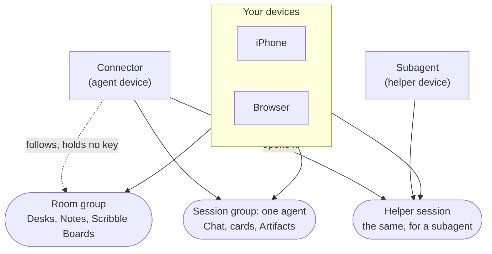
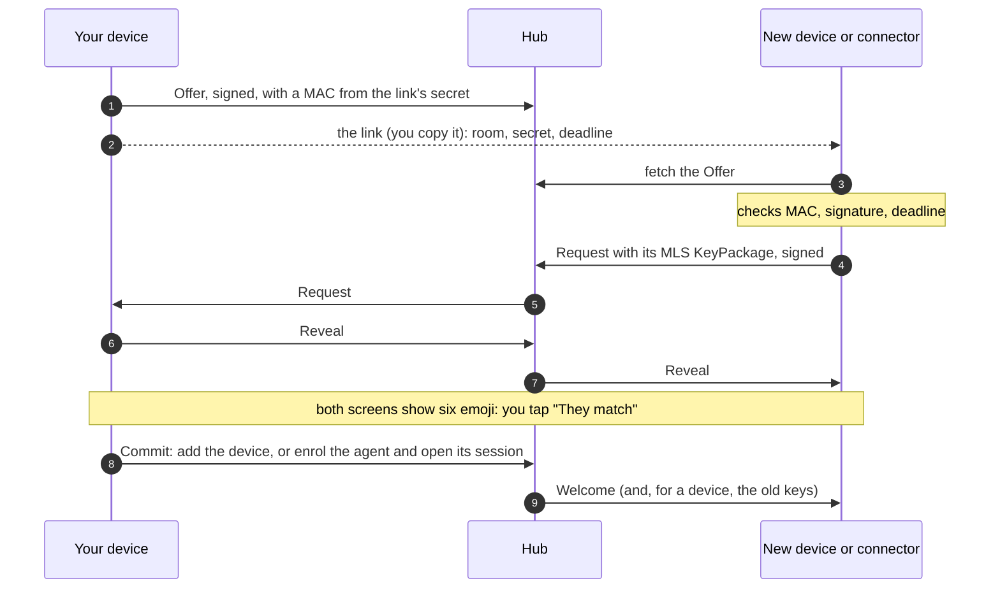
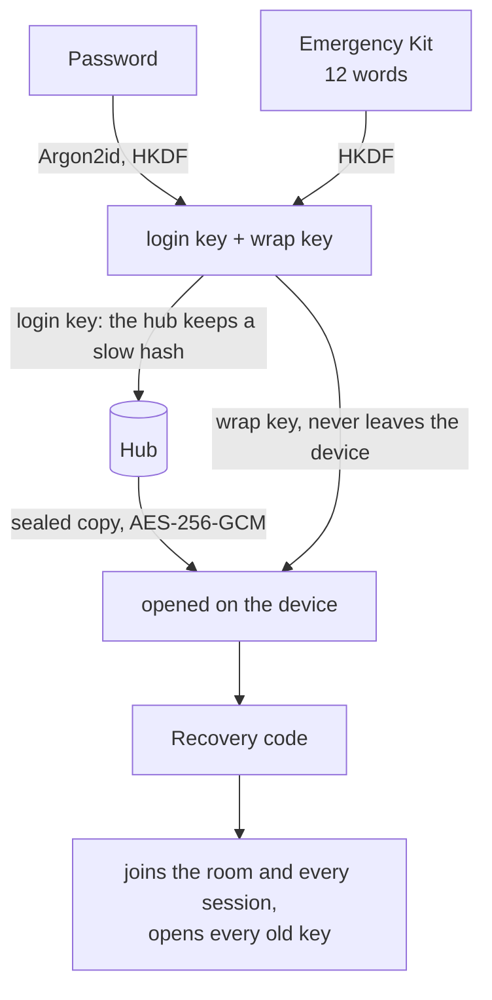
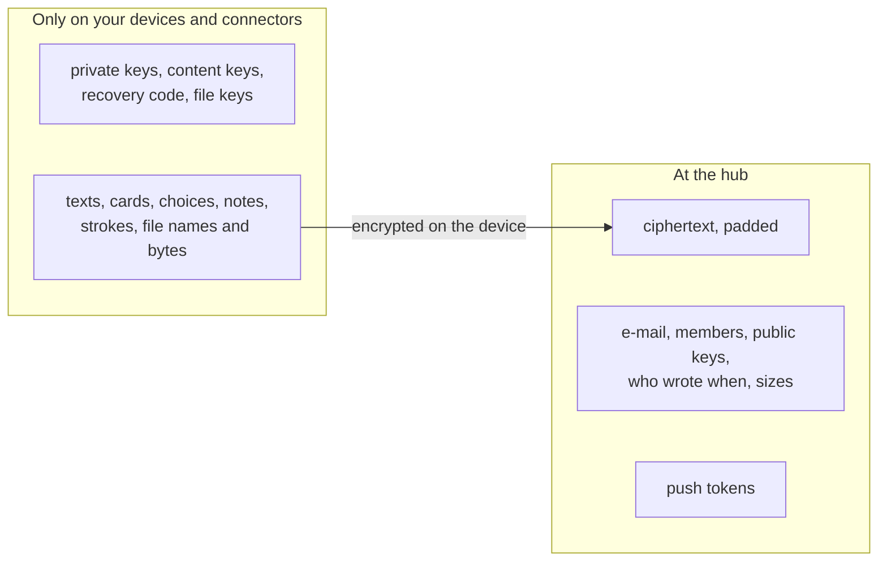
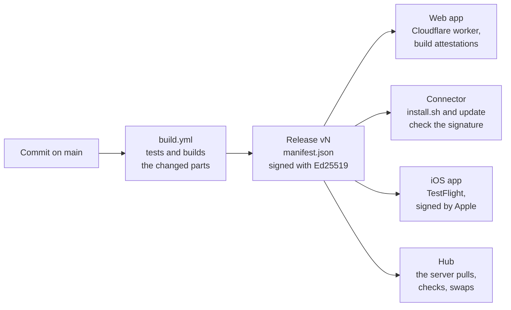
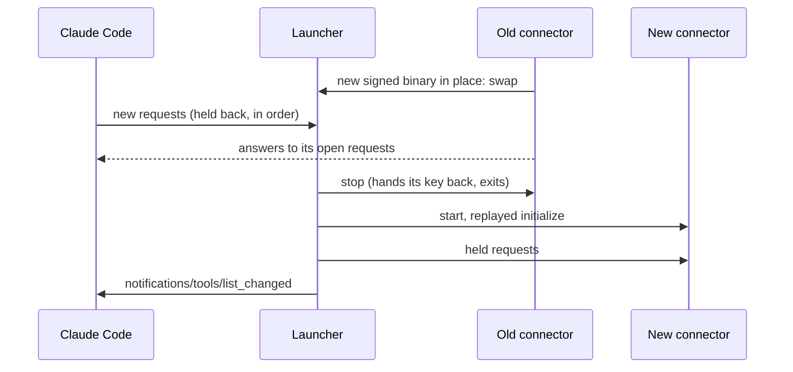

# Trommi

**Your agents ring. You decide.**

Your Claude Code and Codex sessions ask, you answer: chat, decision cards and a Scribble Board, on the web and on
the iPhone. Everything is encrypted on the devices with MLS (RFC 9420); the server only passes sealed messages on.
One Rust core does the cryptography for the web app, the iOS app and the connector.

- 💬 **Chat** with every agent session, the terminal mirrored
- 🃏 **Decision cards**: the agent asks, you tap an answer
- ✏️ **Scribble Board**: draw, write, stick notes, send them to an agent
- 🗂 **Desks** to sort your agents, with their helpers under them
- 🔒 **End-to-end encrypted**: the server never holds a key or reads content

**[→ Open Trommi](https://app.trommi.com)**

## Install

1. **The app:** [app.trommi.com](https://app.trommi.com) in any browser. The iOS app is on TestFlight for testers
   for now.
2. **An agent**, on a Linux or macOS computer with Claude Code or Codex. Once per machine:

   ```sh
   curl -fsSL https://raw.githubusercontent.com/trommi/trommi/main/install.sh | sh
   ```

3. In the app: **Invite an agent**. In the project folder start `claude` and paste the line it shows:

   ```
   /trommi:connect '<link>'
   ```

   Claude Code asks once whether to use the trommi MCP server: choose "Use this MCP server". Six emoji appear in
   the terminal and in the app; tap "They match". In Codex, ask the agent to connect with the link.

Updates come by themselves: a running connector installs a new signed release and swaps it in, no restart and no
/mcp → Reconnect. By hand: `trommi-connector update`.

## How it works

- **Room:** everything of one account, shared by all of your devices.
- **Sessions:** each agent session is its own encrypted group: your devices and that agent, nobody else.
- **Hub:** the server stores ciphertext and who is in which group, and pushes to your devices. It cannot read a
  message, a card, a file or a key.
- **Connector:** one signed program that joins a Claude Code or Codex session to your room.
  What the agent is told: [connector/prompt.md](connector/prompt.md).

```
                         core/  (Rust, OpenMLS)
                 one implementation of all cryptography
                                   │
       ┌──────────────────┬────────┴─────────┬──────────────────┐
       │ WebAssembly      │ UniFFI (Swift)   │ native           │ native
       ▼                  ▼                  ▼                  ▼
    app/web/           app/ios/          connector/            hub/
   web app in        iPhone and        Claude Code and       the server:
   the browser          iPad           Codex sessions     stores ciphertext,
       │                  │                  │            checks MLS changes
       └───────────── MLS (end-to-end encrypted) ───────────────▲
                    sealed messages only; keys stay on devices
```

## Under the hood

<details>
<summary><b>Encryption</b> · MLS, one suite, one Rust core</summary>

- **MLS** ([RFC 9420](https://www.rfc-editor.org/rfc/rfc9420)) hands out every key, with
  [OpenMLS](https://github.com/openmls/openmls) `=0.9.1`.
- **One suite**, no negotiation: `MLS_128_DHKEMX25519_CHACHA20POLY1305_SHA256_Ed25519` (X25519, ChaCha20-Poly1305,
  SHA-256, Ed25519).
- **One Rust core** (`core/`, the crate `trommi-core`) does all of it: as WebAssembly in the browser, through UniFFI
  on iOS, natively in the connector and the hub. There is no second implementation.
- **A device is its key:** one Ed25519 key per device, made on the device; private keys never leave it.
- **Content** (chat, cards, notes, board items) is stored as signed envelopes, encrypted under a content key that
  MLS exports per group and key period. **Files** get a random key of their own each, sent inside the encrypted
  message that names the file.
- **History is readable by your devices, by decision:** a new device of yours gets the old keys and reads
  everything, and so does the recovery code. That is not forward secret for history. A copied device state opens
  nothing new after that device's next update (your devices update about once a week) or its removal.

</details>

<details>
<summary><b>Rooms, sessions and devices</b> · who is in which group</summary>



- **Room group:** all of your devices (at most 1000) and nothing else. It protects what belongs to you, not to one
  agent: Desks, Goals, Notes, Scribble Boards.
- **Session group:** one per agent session: your devices and that agent's connector. One agent never reads
  another's session, and no agent reads the room group.
- **Helper session:** a subagent's own group, opened by its agent's connector, with your devices in it.
- Which Desk an agent sits on is only a value inside the room group: moving it changes no key.
- **Removing** a device or agent takes it out of every group at once, and the hub ends its access.

</details>

<details>
<summary><b>Joining a device or an agent</b> · a link and six emoji</summary>



- The **secret** is only in the link; the hub never sees it. The MAC ties the Offer to the link, so a hub cannot
  serve an Offer of its own.
- The **deadline** is in the link and in every key the secret gives: 10 minutes for a device, 15 for an agent.
  A link is used once; "They don't match" burns it.
- The **six emoji** (36 bits) are computed from everything exchanged, the new device's KeyPackage included. Nothing
  is added before you confirm them; this is what stops a hostile hub from slipping in a device of its own.
- **Signing in** on a new device with your password needs no emoji: the recovery code is the authority
  (Account and recovery, below).

</details>

<details>
<summary><b>Account and recovery</b> · password, recovery code, Emergency Kit</summary>



- Every room has one **recovery code** (32 random bytes). The account holds it only sealed: one copy under your
  password (Argon2id, 64 MiB, then HKDF and AES-256-GCM), one under the Emergency Kit's 12 words.
- The hub never sees the password, the words or the code. It keeps a slow hash of the login key and refuses to
  remove the last way in.
- With the code a new device joins the room and every live session, and opens the content key of every group and
  key period, which each change seals to the recovery key at the hub (HPKE). A MAC that only your devices can make
  ties those copies to you, so a hub cannot hand you a history of its own making.
- **Emergency Kit:** the 12 words and your account ID, to print. **Nobody can reset an account**: without password,
  kit and devices the content is gone.
- Wrong passwords slow the source down; there is no lockout. **Passkeys** are built and off for now.
- After you remove a device that is not in your hands, the app asks you to replace the code.

</details>

<details>
<summary><b>What the hub sees</b> · and what it cannot</summary>



| The hub reads | The hub cannot read |
|---|---|
| your e-mail, a slow hash of your login key | password, Emergency Kit words, recovery code |
| who is in which group, their public keys, every group change | any private key or content key |
| per stored item: sender, group, time, kind, a card's state and urgency, the padded size | every body: texts, titles, options, choices, strokes |
| files: id, exact size, uploader | file bytes, names, types, keys |
| per Scribble Board: when a snapshot was written, up to which item it reaches, which files are still on it | the shapes, what was erased |
| push endpoints and tokens | nothing: a push carries no content |

- The hub checks every MLS change it can check in public and refuses a device that was not invited.
- The hub keeps only what is still needed: a writer's older register values and Note versions, board items behind every device's snapshot, and objects settled 30 days ago lose their bodies; strokes being drawn are passed on and never stored.
- The whole table per stored thing: [`spec/v1.md`](spec/v1.md), section 14.

</details>

<details>
<summary><b>Signed releases and deployment</b> · one signed release per change</summary>



- A change makes **one release `v<N>`** with every part and one `manifest.json` (each file's size and SHA-256),
  signed with Ed25519. Public key: [`release/public-key.pem`](release/public-key.pem); the private key lives in
  1Password. Each part is delivered only when it changed.
- **The hub:** CI sends no code and has no SSH, only "take `v<N>`" over the private network. The server's updater
  (its own user, no root) fetches the release itself, checks it against the pinned key, refuses anything older,
  swaps, and puts the release before back if the new hub is not well within 60 s.
- **The web app** cannot be signed for a browser: every file it serves carries a GitHub build attestation.
- Pull requests get no secrets and deploy nothing.

Check a release, and a file the web app serves:

```sh
release/sign.sh verify manifest.json   # the signature
release/sign.sh files manifest.json    # each file against the manifest

curl -fsS https://app.trommi.com/index.html -o index.html
gh attestation verify index.html --repo trommi/trommi
```

The whole way, what goes wrong and what runs as root: [hub/deploy/README.md](hub/deploy/README.md).

</details>

<details>
<summary><b>Connector updates</b> · swapped in, no reconnect</summary>

What Claude Code or Codex starts is a small **launcher** ([`connector/src/launch.rs`](connector/src/launch.rs)). It
owns the session's stdin and stdout and runs the real connector as its child, passing every JSON-RPC line through.

- **Found:** the connector looks for a newer release every hour, and at once when the hub refuses it as too old.
- **Checked:** only a release signed with the release key is put in place, as `trommi-connector update` does.
- **Swapped:** the launcher holds the client's new messages back, lets the old child answer every request it took,
  stops it, starts the new one, replays the session's handshake to it, then sends the held messages and
  `notifications/tools/list_changed`. The client keeps the same process and pipe, so it never sees a restart.



- Sessions started before the launcher existed need **one** /mcp → trommi → Reconnect; after that, never again.
- The launcher almost never changes. If an update needs a new one, the app shows the update card with that one
  reconnect instead.

</details>

<details>
<summary><b>Protocol</b> · spec, deviations, hub API</summary>

| | |
|---|---|
| [`spec/v1.md`](spec/v1.md) | the protocol: groups, content, recovery, joining, what a hub must do and sees |
| [`spec/v1-deviations.md`](spec/v1-deviations.md) | the five places where plain MLS is not enough, and why |
| [`spec/hub-api.md`](spec/hub-api.md) | the hub's routes and tables |
| `spec/vectors/` | known answers the core must produce |

The code follows the specification, not the other way round. More: [`spec/README.md`](spec/README.md).

</details>

<details>
<summary><b>Known limits</b> · what this does not protect</summary>

- No forward secrecy for history (see Encryption).
- The hub sees who is in which group and when anyone writes.
- In the browser, the app's code is loaded from Cloudflare (app.trommi.com) each time; whoever controls that
  delivery (our Cloudflare account or the deploy pipeline) could ship code that reads your keys. The hub cannot.
  The iOS app and the connector do not have this risk: they are installed signed releases.
- The connector checks its updates, not its own start.
- A hub rollback does not roll back the database.
- Post-quantum: planned once OpenMLS ships a suite.

The whole list, with everything that is in place: [SECURITY.md](SECURITY.md).

</details>

## Development

<details>
<summary><b>Repository layout</b> · core, hub, apps, connector</summary>

| | |
|---|---|
| `core/` | the shared Rust core on OpenMLS; `core/wasm` for the browser, `core/swift` for iOS |
| `hub/` | the hub (the server) and its updater; `hub/deploy/` installs it |
| `app/web/` | the web app |
| `app/ios/` | the iOS app (Swift, SwiftUI) |
| `connector/` | the connector: the program and the Claude Code plugin |
| `demo/` | the demo room, built into the web app and the iOS app |
| `tests/` | every part's tests, one folder per part |
| `spec/` | the protocol, the hub's API, the test vectors |
| `release/` | the signed release: manifest, signature, public key |
| `site/` | the website trommi.com |
| `.github/` | the workflows and their scripts |

Each part has its own README with the details.

</details>

<details>
<summary><b>Build and tests</b> · Rust, Node, Swift</summary>

Rust is pinned in `rust-toolchain.toml`, Node in `.node-version`.

```sh
# Core, hub, connector
cargo test --locked -p trommi-core
cargo test --locked -p trommi-tests          # core, hub, connector and deploy tests
cargo build --release -p trommi-hub -p trommi-connector

# Web app (its package.json is in app/web)
(cd app/web && npm ci)
(cd app/web && npm run build:core)            # the core as WebAssembly
(cd app/web && npm test)
node app/web/dev/serve.mjs 8900               # the app; ?mock=1 for the demo room

# iOS
core/swift/build.sh                           # the core for Swift
(cd tests/ios && swift test)
```

More: [`app/web/README.md`](app/web/README.md), [`app/ios/README.md`](app/ios/README.md),
[`connector/README.md`](connector/README.md), [`core/README.md`](core/README.md).

</details>

## License

[O'Saasy](LICENSE.md). Third-party licences: [THIRD-PARTY.md](THIRD-PARTY.md) (the web app's own:
[`app/web/THIRD-PARTY.md`](app/web/THIRD-PARTY.md)).

Found a vulnerability? Write to trommi@mail101.de.
