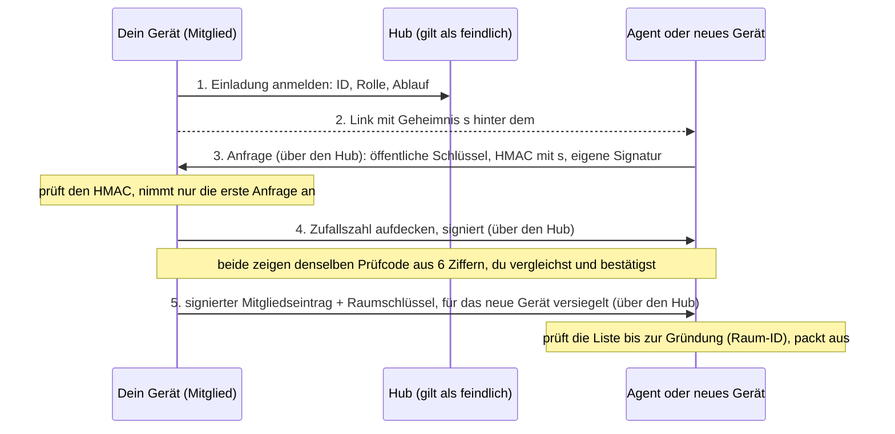

# Trommi Krypto-Konzept

Zero Trust: Der Hub ist ein feindlicher Briefkasten. Zweiter Entwurf vom 2. Oktober 2026, zur Entscheidung, noch nicht gebaut.

> **Kern.** Jedes Gerät und jeder Agent hat eigene Schlüssel. Wer dazugehört, steht in einer signierten Mitgliederliste, die der Server weder fälschen noch unbemerkt zurückdrehen kann. Ein einziger Raumschlüssel verschlüsselt die Inhalte, ohne Ratchet. Jede Nachricht ist vom Absendergerät signiert und verkettet. Ein Agent führt nur aus, was nachweislich von einem zugelassenen Gerät eines Menschen stammt. Der Server sieht Chiffretext und genau die Metadaten, die er zum Zustellen und zum Löschen nach 30 Tagen braucht.

**Aus säckel übernommen:** Schlüssel werden je Mitglied mit dessen öffentlichem Schlüssel versiegelt (X25519, HKDF, AES-256-GCM); Entfernen rotiert den Schlüssel; ein Wiederherstellungscode mit 256 Bit; jeder Chiffretext ist an seinen Ort gebunden (zusätzliche Daten); Versionspräfix in jedem Format; Auffüllen gegen verräterische Längen; eine offene Liste der Klartext-Metadaten. **Anders als säckel:** Dort entschlüsselt der Server im Arbeitsspeicher, mit Schlüsseln aus dem Passwort; ein übernommener laufender Server liest mit. Bei Trommi entschlüsseln nur die Endpunkte. säckel hat noch keine Signaturen und nennt als Grenze, dass der Server einen falschen öffentlichen Schlüssel unterschieben kann. Das löst hier die Mitgliederliste.

## 1. Bedrohungsmodell

| Angreifer | Kann höchstens | Kann nicht |
| --- | --- | --- |
| Netz | Größen und Zeitpunkte sehen (TLS bleibt Pflicht) | lesen, ändern |
| Bösartiger Server, Speicher, Backup | Metadaten lesen, Dienst verweigern, das Ende eines Verlaufs zurückhalten, dem Browser anderen Code liefern (Abschnitt 9) | Inhalte lesen, Befehle fälschen, Mitglieder hinzufügen, unbemerkt weglassen, umsortieren, wiederholen |
| Gestohlener Einladungslink | vor dem echten Empfänger beitreten, in der Rolle des Links, bis zum Ablauf | mit Prüfcode: gar nicht beitreten. Als Agent: keine Befehle geben, keinen alten Verlauf lesen |
| Gestohlenes Gerät | alles lesen und Befehle geben, bis es entfernt ist | nach Entfernen und Rotation Neues lesen; den Wiederherstellungsschlüssel überstimmen |
| Bösartige Agenten-Sitzung | den Raum ab ihrem Beitritt mitlesen, als sie selbst senden | Befehle an andere Agenten geben, Mitglieder ändern, sich als Mensch ausgeben |
| Anderer Mandant | die Existenz eines Raums erraten | beitreten oder lesen: ohne Eintrag in der Liste und ohne Schlüssel |

**Außerhalb:** Schadsoftware auf einem entsperrten Endgerät, bösartige Browser-Erweiterungen, Prompt Injection über Inhalte, Verkehrsanalyse, Dienstverweigerung. Der Klartext endet beim Agenten: Dort liegt er im Transkript von Claude Code und geht an den Modellanbieter.

## 2. Identitäten und Schlüssel

| Schlüssel | Art | Liegt wo |
| --- | --- | --- |
| Geräte-Signaturschlüssel | Ed25519, je Gerät und je Agent | Browser: WebCrypto, nicht exportierbar, in IndexedDB. iOS: Keychain, „nur dieses Gerät“. Linux: Secret Service (libsecret). Agent: Datei mit Modus 0600 im Datenordner des Channel-Prozesses. |
| Geräte-Tauschschlüssel | X25519, je Gerät und je Agent | Browser: WebCrypto, nicht exportierbar, in IndexedDB. iOS: Keychain, „nur dieses Gerät“. Linux: Secret Service (libsecret). Agent: Datei mit Modus 0600 im Datenordner des Channel-Prozesses. |
| Wiederherstellungsschlüssel | Ed25519 und X25519, per HKDF aus dem Wiederherstellungscode | Nur auf Papier oder im Passwortmanager. Der öffentliche Teil steht im Gründungseintrag. |
| Raumschlüssel | 32 zufällige Bytes je Epoche | Bei jedem Mitglied, im selben Speicher wie die Geräteschlüssel. Auf dem Server nur versiegelt. |

**Mitgliederliste.** Ein Protokoll, an das nur angehängt wird. Jeder Eintrag (Gerät hinzu, Gerät entfernt, neue Epoche) trägt Nummer, Hash des Vorgängers und die Signatur eines Menschengeräts oder des Wiederherstellungsschlüssels. Agenten dürfen nichts eintragen. Der erste Eintrag (Gründung) nennt das erste Gerät und den Wiederherstellungsschlüssel. **Die Raum-ID ist der Hash des Gründungseintrags.** Wer die Raum-ID aus dem Link kennt, kann die ganze Liste ohne Vertrauen in den Server prüfen.

**Zurückdrehen und Gabeln.** Jedes Gerät merkt sich Nummer und Hash des neuesten Eintrags und nimmt nie einen älteren Stand an. Jede Nachricht nennt den Stand der Liste, den ihr Absender kennt. Zeigt der Server zwei Geräten verschiedene Listen, fällt das mit der ersten Nachricht zwischen ihnen auf: gleiche Nummer, anderer Hash. Der Client hält dann an und meldet es. Ein Eintrag des Wiederherstellungsschlüssels schlägt jeden Eintrag eines Geräts.

## 3. Einschreiben per Einladungslink



- **Link:** `https://app…/join#v1.hub.raum-id.s` mit 256 Bit Geheimnis `s`. Die Version steht vorn. Der Server kennt nur die Einladungs-ID, die per HKDF aus `s` entsteht.
- **Der HMAC bindet:** Version, Raum-ID, Hub-Adresse, Einladungs-ID, Rolle, Name und beide öffentlichen Schlüssel des neuen Geräts. Der Server kann keinen Schlüssel austauschen. Die Signatur des neuen Geräts beweist, dass es den privaten Schlüssel hat.
- **Einmalig und kurz:** zehn Minuten, eine Anfrage. Beides setzt dein Gerät durch, nicht der Server. Dein Gerät muss dafür online sein.
- **Prüfcode:** sechs Ziffern aus dem Hash des ganzen Ablaufs und einer Zufallszahl, die dein Gerät erst nach Eingang der Anfrage aufdeckt (Festlegen, dann aufdecken, wie bei ZRTP und der Matrix-Verifikation). Ohne diese Reihenfolge könnte ein Angreifer Schlüssel durchprobieren, bis der Code passt.
- **Gestohlener Link:** Ohne Prüfcode gilt: Wer zuerst kommt, ist drin. Dann begrenzen drei Dinge den Schaden. Der Link trägt eine Rolle; ein Agenten-Link ergibt nie ein Gerät, das Befehle geben darf. Agenten bekommen keine alten Epochenschlüssel. Kommt der echte Empfänger zu spät, meldet er „Einladung schon verbraucht“, und du entfernst den Fremden mit einem Tipp (Rotation).

## 4. Der eine Raumschlüssel

- **Entstehen:** Das erste Gerät würfelt den Schlüssel der Epoche 1.
- **Verpacken:** Für jedes Mitglied eine versiegelte Kopie, wie `Vault.seal` in säckel: flüchtiger X25519-Schlüssel, HKDF-SHA-256 über das gemeinsame Geheimnis mit beiden öffentlichen Schlüsseln als Salt, AES-256-GCM. Das ist das Muster von HPKE (RFC 9180). Raum-ID, Epoche und Empfänger sind als zusätzliche Daten gebunden.
- **Rotieren:** sofort beim Entfernen eines Mitglieds, sonst alle 30 Tage. Ein Menschengerät würfelt den neuen Schlüssel, versiegelt ihn für alle Verbleibenden und trägt die neue Epoche in die Liste ein. Abwesende Geräte holen ihre Kopie später. Anders als in säckel wird nichts neu verschlüsselt: Das Protokoll wird nur fortgeschrieben.
- **Alte Epochen:** Jeder neue Schlüssel verschlüsselt seinen Vorgänger. Menschengeräte lesen so den ganzen Verlauf, Agenten bekommen diese Kette nicht.
- **Entferntes Mitglied:** liest weiter, was es schon hatte, und jede alte Epoche, deren Chiffretext es noch bekommt. Nichts Neues.

> **Was „kein Ratchet“ kostet.** Keine Vorwärtsgeheimhaltung: Wer einen Epochenschlüssel und die Chiffretexte hat, liest die ganze Epoche, als Mensch auch alle früheren. Keine Selbstheilung: Wer den privaten Schlüssel eines Geräts hat, packt auch jede künftige Epoche aus, bis das Gerät entfernt ist. Die Rotation nach Zeitplan hilft nur gegen einen Raumschlüssel, der einzeln abgeflossen ist. Und ein Schlüssel für alle heißt: Jeder Agent kann die Gespräche aller anderen Agenten lesen. Signaturen bleiben davon unberührt: Mit dem Raumschlüssel allein lässt sich kein Befehl fälschen. Die 30-Tage-Löschung begrenzt, was an Karten und Anhängen überhaupt noch da ist.

## 5. Umschlag einer Nachricht

```text
+------------------------------+--------+---------------------------+-----------+
| Kopf, im Klartext            | Nonce  | Chiffretext + Tag         | Signatur  |
| Raum, Epoche, Absender, Nr., | 96 Bit | AES-256-GCM, aufgefüllt   | Ed25519   |
| Vorgänger-Hash ...           |        |                           |           |
+------------------------------+--------+---------------------------+-----------+
 \__ zusätzliche Daten der Verschlüsselung __/
 \______ die Signatur des Absendergeräts deckt Kopf, Nonce, Chiffretext ______/
```

Kette: „Vorgänger-Hash“ ist der Hash des vorigen Umschlags desselben Absenders. „Gesehen“ nennt den letzten Stand der anderen. Der Server prüft die Signatur ebenfalls und weist Fremdes ab. Verlassen muss sich darauf niemand.

- **Kopf:** Version, Raum-ID, Epoche, Absendergerät, laufende Nummer, Hash des Vorgängers, Stand der Mitgliederliste, Empfänger (ein Agent oder alle), Zeit, „gesehen“ (Nummer und Hash des letzten Umschlags der anderen Absender). Dazu nur bei Bedarf: Karten-ID, Kartenstatus, Antwortzeit, Verweise auf Anhänge.
- **Nonce, sicher für einen langlebigen Schlüssel auf vielen Geräten:** Niemand verschlüsselt mit dem Raumschlüssel selbst. Jeder Absender leitet je Epoche einen eigenen Schlüssel ab: HKDF(Raumschlüssel, Raum-ID, Epoche, Geräte-ID). Zwei Geräte können sich so nie in die Quere kommen. Darunter ist die Nonce 96 Bit Zufall. NIST erlaubt dafür 2^32 Nachrichten je Schlüssel; ein Gerät kommt in 30 Tagen nicht in die Nähe. Zufall statt Zähler, weil ein zurückgesetzter Zähler (zwei Tabs, wiederhergestelltes Profil) bei GCM Klartext und Echtheit preisgibt.
- **Signiert werden Bytes, kein JSON.** Der Kopf reist als fertige Bytefolge; der Empfänger prüft erst und liest dann. Das erspart eine kanonische JSON-Form.
- **Was der Server damit nicht mehr kann.** Wiederholen: Jede Nummer gilt je Absender einmal. Weglassen und Umsortieren: Nummer und Hash des Vorgängers passen nicht. Zusammenstückeln: Raum, Epoche und Absender stecken in Schlüssel, zusätzlichen Daten und Signatur. Der Client zeigt eine Lücke an und fordert gezielt nach; Nummer und Geräte-ID dienen zugleich als Client-ID gegen doppelte Zustellung.
- **Was bleibt:** Das Ende zurückhalten kann der Server immer. Es fällt auf, sobald irgendein Umschlag ankommt, dessen „gesehen“ weiter ist als der eigene Stand. Sonst zeigt der Client nur, seit wann ein Absender schweigt.
- **Löschen ohne Kettenbruch:** Der Hash eines Umschlags geht über Kopf und Hash des Chiffretexts. Nach 30 Tagen löscht der Server den Chiffretext und behält Kopf und Hash (rund 300 Bytes).

## 6. Was ein Agent ausführt

Der Channel-Prozess neben dem Agenten prüft jeden Umschlag, bevor Claude Code etwas davon sieht: Signatur gültig; Absender steht in der Liste mit Rolle Mensch und ist nicht entfernt; Epoche aktuell (die vorige gilt noch zwei Minuten); Nummer ist die nächste dieses Absenders; Empfänger ist dieser Agent. Sonst wird verworfen und gemeldet.

| Befehl | Zusätzlich gebunden an | Abgelehnt, wenn |
| --- | --- | --- |
| Entscheidung | Karten-ID, gewählte Option, Hash des Umschlags, mit dem der Agent die Karte angelegt oder zuletzt geändert hat | die Karte nicht offen ist oder der Hash nicht passt. Der Mensch hat dann etwas anderes gesehen. |
| Freigabe | Anfrage-ID und Hash der Anfrage (Tool und Eingabe, wie der Agent sie signiert hat), Ablaufzeit | die Anfrage nicht mehr wartet, abgelaufen ist oder der Hash nicht passt. Ob Terminal oder Ferne zuerst kam, entscheidet weiter Claude Code. |
| Neu entscheiden | Hash der Entscheidung, die zurückgenommen wird | diese Entscheidung nicht die geltende ist |
| Chat, Scribble | „gesehen“: der letzte Umschlag des Agenten, den das Gerät kannte | nie; aber verspätet Zugestelltes bekommt der Agent als „verspätet“ markiert |

Karten, Statuszeilen und Antworten eines Agenten nimmt ein Client nur von diesem Agenten an. Heute prüft das der Hub, künftig die Signatur.

## 7. Was der Server sieht

| Verborgen | Bewusst im Klartext, signiert | Unvermeidbar sichtbar |
| --- | --- | --- |
| Text von Nachrichten und Karten, Optionen, Anmerkungen, gewählte Option, Dringlichkeit, Statuszeilen, Namen der Sitzungen, Anhänge, Canvas, Dateinamen und Dateitypen | Raum, Epoche, Absender, Empfänger, Nummern und Hashes; Karten-ID, Kartenstatus und Antwortzeit (für die Löschung nach 30 Tagen); Verweise auf Anhänge; ein Bit „Push senden“ | Wer Mitglied ist und in welcher Rolle, wer wann online ist, IP-Adressen, Zeitpunkte, Größen (in Stufen aufgefüllt) |

„Zero Knowledge“ gilt für Inhalte, nicht für Metadaten. Die Karten-Metadaten sind signiert: Der Server liest sie, kann sie aber nicht ändern.

- **Anhänge:** Jede Datei bekommt einen eigenen Zufallsschlüssel (wie Dokumente in säckel) und wird in Stücken von 64 KiB verschlüsselt, mit Stücknummer und Schlussmarke in der Nonce (STREAM-Konstruktion, wie in age und Tink). So bleiben Spulen und Teilabrufe möglich. Dateischlüssel, Hash, Name und Typ stehen in der verschlüsselten Nachricht, im Kopf nur die Blob-ID. Der Server löscht Blobs mit der Karte.
- **Canvas:** ein verschlüsselter Blob je Sitzung, signiert und mit Versionsnummer. Clients nehmen keine ältere Version an. Gespeichert wird mit Verzögerung, nicht bei jedem Strich.
- **Sprache** braucht Klartext und darf deshalb nur an Endpunkten geschehen. `create_voiceover` läuft im Channel-Prozess des Agenten. Diktat und Vorlesen: auf iOS mit der Erkennung und Stimme des Geräts oder direkt bei Tinfoil; im Browser direkt bei Tinfoil. Der Tinfoil-Schlüssel wird dazu als verschlüsselte Raum-Einstellung verteilt. Der Hub ruft Tinfoil nicht mehr auf.

## 8. Anmelden am Server ohne Inhaber-Token

- **Ablauf:** Der Server schickt eine Zufallszahl, das Gerät signiert sie zusammen mit Raum-ID und Hub-Adresse. Der Server prüft gegen die Mitgliederliste und gibt ein Zugangstoken für zehn Minuten aus, gebunden an dieses Gerät. Kein Cookie, kein Token im Link. Agenten melden sich genauso an; das gemeinsame Token in `data/token` entfällt.
- **Schreibende Anfragen** brauchen kein Extra: Jeder Umschlag ist schon signiert. Ein gestohlenes Token kann zehn Minuten lang Chiffretext abholen, sonst nichts.
- **SSE:** `EventSource` kann keine Kopfzeilen setzen. Der Client liest den Strom deshalb mit `fetch` und sendet das Token im `Authorization`-Kopf. Wiederverbinden gehört ohnehin dem Client.
- **Ein Gerät sperren:** Eintrag „entfernt“ in der Liste. Der Server trennt die Verbindungen des Geräts und stellt ihm kein Token mehr aus; die Rotation schließt es von allem Neuen aus. Hält der Server sich nicht daran, bekommt das Gerät Chiffretext, den es nicht mehr öffnen kann.

Die Zugangsprüfung des Servers schützt Metadaten und Verfügbarkeit. Die Vertraulichkeit hängt nicht an ihr.

## 9. Wer liefert den Code, der entschlüsselt?

Wer das JavaScript liefert, kann Schlüssel benutzen und Klartext abgreifen. Nicht exportierbare Schlüssel verhindern das Kopieren des Schlüssels, nicht seinen Missbrauch in der offenen Seite.

| Weg | Bringt | Kostet, bleibt offen |
| --- | --- | --- |
| Hub liefert den Client (heute) | nichts gegen einen bösartigen Hub | hebt Zero Knowledge gegen einen aktiven Server auf |
| Statischer Client von fester, eigener Adresse | Ein fremder oder übernommener Hub kann den Code nicht ändern. Schlüssel hängen an dieser Adresse, nicht am Hub. | Vertrauen wandert zum Betreiber dieser Adresse. Der Hub braucht CORS und HTTPS. |
| Prüfsummen (SRI) in einer kleinen Startseite | Jede Datei wird gegen ihren Hash geprüft; für Module über `integrity` in der Import Map | Die Startseite selbst prüft niemand. Ein Skript muss die Hash-Liste je Version schreiben. |
| Signierte Versionen | Ohne Build-Schritt sind die ausgelieferten Dateien Byte für Byte die aus dem Git-Tag. Jeder kann nachrechnen. | Der Browser prüft das nicht von selbst; es ist Kontrolle im Nachhinein. |
| Installierte Apps (iOS, Linux) | Code kommt einmal, signiert, über den Store oder ein Paket | Vertrauen in Store und Signierschlüssel. Eine installierte PWA lädt weiter vom Server und zählt nicht dazu. |

**Ungelöst:** Ein gewöhnlicher Browser-Tab vertraut bei jedem Laden der Adresse, die den Code liefert. Auch ein Service Worker hilft nicht, weil dieselbe Adresse ihn ersetzen darf.

**Empfehlung:** Web-Client von einer festen, vom Hub getrennten Adresse, mit strenger Content Security Policy, SRI und signierten Git-Tags. Keine fremden Quellen mehr: Die Schriften von Google Fonts werden selbst ausgeliefert. Wer selbst betreibt, liefert den Client vom eigenen Rechner. Die nativen Apps sind der Vertrauensanker: Neue Menschengeräte einschreiben und Geräte entfernen sollte man dort tun. Der Browser bekommt dieselben Rechte, aber der Text sagt ehrlich, dass er dem Auslieferer vertraut.

## 10. Verlust und Wiederherstellung

| Fall | Folge |
| --- | --- |
| Ein Gerät verloren | Auf einem anderen Gerät entfernen. Das rotiert den Raumschlüssel. |
| Alle Geräte verloren, Code vorhanden | Neues Gerät, Code eingeben. Der Wiederherstellungsschlüssel trägt das neue Gerät ein, entfernt alle alten und öffnet die Epochenschlüssel. Danach gibt es einen neuen Code, wie in säckel. |
| Alle Geräte und Code verloren | Der Raum ist verloren. Neuer Raum, Agenten neu einladen. Kein Reset per E-Mail: Er könnte nichts entschlüsseln. |
| Schlüsseldatei eines Agenten verloren | Agenten neu einladen. Er bekommt eine neue Identität. |
| Browser löscht seinen Speicher | Wie ein verlorenes Gerät. Safari löscht Skript-Speicher nach sieben Tagen ohne Besuch; zum Home-Bildschirm hinzugefügte Seiten sind ausgenommen. |
| Server verliert Daten | Backups enthalten nur Chiffretext und dürfen überall liegen. Clients halten nur einen Cache. |

Der Code hat 256 Bit und wird einmal angezeigt, in Vierergruppen (Crockford-Base32, wie in säckel). Für jede Epoche liegt eine versiegelte Kopie des Raumschlüssels für den Wiederherstellungsschlüssel auf dem Server.

## 11. Verfahren und Leistung

| Zweck | Verfahren | Browser | iOS (CryptoKit) | Node, Linux |
| --- | --- | --- | --- | --- |
| Signatur | Ed25519 | WebCrypto: Chrome 137, Firefox 129, Safari 17 | Curve25519.Signing | Node 22: dieselbe WebCrypto-Schnittstelle. Linux nativ: libsodium oder OpenSSL 3. |
| Schlüsseltausch | X25519 | WebCrypto: Chrome 137, Firefox 129, Safari 17 | Curve25519.KeyAgreement | Node 22: dieselbe WebCrypto-Schnittstelle. Linux nativ: libsodium oder OpenSSL 3. |
| Inhalte | AES-256-GCM | überall | AES.GCM | Node 22: dieselbe WebCrypto-Schnittstelle. Linux nativ: libsodium oder OpenSSL 3. |
| Ableiten | HKDF-SHA-256 | überall | HKDF | Node 22: dieselbe WebCrypto-Schnittstelle. Linux nativ: libsodium oder OpenSSL 3. |
| Einladung, Hashes | HMAC-SHA-256, SHA-256 | überall | HMAC, SHA256 | Node 22: dieselbe WebCrypto-Schnittstelle. Linux nativ: libsodium oder OpenSSL 3. |

- **Ein Modul für zwei Orte:** Web-Client und Channel-Prozess können dieselbe JavaScript-Datei nutzen, weil Node dieselbe Schnittstelle hat. Kein Build-Schritt, keine Krypto-Bibliothek.
- **ChaCha20-Poly1305** gibt es in WebCrypto nicht, also AES-GCM überall. XAES-256-GCM wäre die benannte Konstruktion für lange Zufalls-Nonces; die Ableitung je Absender erreicht hier dasselbe mit Bordmitteln.
- **Kein Rückfall auf JavaScript-Krypto.** Ältere Browser bekommen eine klare Meldung. Eine Bibliothek in JavaScript hielte die Schlüssel als lesbare Bytes.
- **Secure Enclave** kann klassisch nur P-256, kein Curve25519. Auf iOS liegen die Schlüssel deshalb im Keychain, auf Wunsch zusätzlich mit einem Enclave-Schlüssel verpackt (offene Entscheidung 1).
- **Gemessen** (Node 26, WebCrypto, dieser Rechner): signieren 42 µs, prüfen 88 µs, 1 KiB verschlüsseln 18 µs. Eine Nachricht kostet unter 0,2 ms. 10 000 Umschläge beim ersten Laden prüfen: etwa eine Sekunde. Browser und Telefon sind nicht gemessen; dort ist mit dem Zwei- bis Fünffachen zu rechnen.
- **Voraussetzung:** WebCrypto gibt es nur über HTTPS oder auf localhost. TLS (etwa `tailscale serve`) ist damit Pflicht.

## 12. Umbau in Schritten

Jeder Schritt hinterlässt ein lauffähiges System.

1. **Fester Hub und TLS.** Ein eigener Hub-Prozess statt „erste Sitzung ist der Hub“. Jeder Channel-Prozess ist ein gewöhnlicher Client. Stabile Agenten-IDs.
2. **Ereignisprotokoll statt Gesamtzustand,** noch im Klartext: Nummer je Absender, Client-ID, gezieltes Nachholen. Clients setzen den Zustand selbst zusammen und sortieren den Stapel selbst nach Dringlichkeit. Der Server vergibt nur eine Abrufnummer.
3. **Geräteschlüssel, Mitgliederliste, Einladung v1, Anmeldung per Signatur.** Token und Cookie entfallen, Geräte lassen sich einzeln sperren. Befehle sind signiert, Agenten prüfen sie. Inhalte noch im Klartext. Das ist der größte Sicherheitsgewinn.
4. **Hash-Kette und Verschlüsselung** mit dem Raumschlüssel. Anhänge und Canvas verschlüsselt, Sprache an die Endpunkte. Der Server behält nur Köpfe und Blobs.
5. **Rotation, Wiederherstellungscode, Prüfcode.**
6. **Client von eigener Adresse,** SRI, signierte Versionen; iOS und Linux ziehen nach.

Aus `docs/gelernt.md` eingelöst: versionierte, einmalige, kurzlebige Einladungen; ein Zugang je Gerät, einzeln sperrbar; laufende Nummer und Client-ID; fester Hub. Für später: verschlüsselte Schnappschüsse, damit ein neues Gerät nicht das ganze Protokoll prüfen muss.

## 13. Offene Entscheidungen

| Nr. | Entweder, oder | Empfehlung |
| --- | --- | --- |
| 1 | Curve25519 überall, oder P-256, damit der iOS-Schlüssel in der Secure Enclave liegt | Curve25519. Ein Verfahren, wie in säckel, keine ECDSA-Fallen. |
| 2 | Ein Raumschlüssel für alle Agenten, oder ein Schlüssel je Agenten-Sitzung (weiter ohne Ratchet) | Einer, wie entschieden. Das Format führt eine Schlüssel-ID, damit der zweite Weg offen bleibt. |
| 3 | Prüfcode immer, oder nur für Menschengeräte | Pflicht für Menschengeräte. Für Agenten voreingestellt an, abschaltbar. |
| 4 | Jedes Menschengerät darf Mitglieder ändern, oder nur ein Hauptgerät | Jedes. Der Wiederherstellungsschlüssel überstimmt. |
| 5 | Dringlichkeit im Klartext, damit der Server sortiert, oder verborgen | Verborgen. Clients sortieren, der Server sieht nur „Push senden“. |
| 6 | Web-Client vom Hub, oder von fester eigener Adresse | Eigene Adresse; heikle Schritte in den nativen Apps. |
| 7 | Rotation nur beim Entfernen, oder zusätzlich alle 30 Tage | Zusätzlich alle 30 Tage. Kostet fast nichts. |
| 8 | Sprache im Browser direkt bei Tinfoil, oder nur in den nativen Apps | Direkt, falls Tinfoil Aufrufe aus dem Browser zulässt. Sonst nur nativ. |
| 9 | Wiederherstellungscode Pflicht, oder freiwillig | Pflicht beim Anlegen des Raums. |

**Nicht nachgeprüft:** ob Safari einen nicht exportierbaren X25519-Schlüssel in IndexedDB zuverlässig speichert (ein Bericht sagt nein; vor Schritt 3 testen, Ausweg: den Schlüssel mit einem nicht exportierbaren AES-Schlüssel verpackt ablegen); ab welcher Version jeder Browser X25519 kann (die Versionen oben sind für Ed25519 belegt); `integrity` in der Import Map (berichtet: Chrome 127, Safari 18.4, Firefox 138); ob Tinfoil Aufrufe aus dem Browser erlaubt (CORS); Zeiten in Browser und iOS. Trommi · Entwurf, zur Entscheidung.

## Entschieden

- 2. Oktober 2026: Prüfcode beim Beitritt ist Pflicht für menschliche Geräte, voreingestellt für Agenten (Board-Karte Nr. 39).

## Entscheidungen vom 2.10.2026 (Christopher, auf dem Board)

- **Curve25519 auf allen Geräten.** Ein Verfahren für Browser, iOS, Linux und Agent; kein P-256 für die Secure Enclave.
- **Jedes eigene Gerät darf Mitglieder ändern.** Kein einzelnes Hauptgerät. Der Wiederherstellungscode steht darüber.
- **Web-Oberfläche von einer eigenen festen Adresse**, nicht vom Hub.
- **Raumschlüssel nur beim Entfernen eines Mitglieds erneuern**, nicht zusätzlich alle 30 Tage.
- **Wiederherstellung behält die Agenten als Mitglieder**; entfernt werden nur die menschlichen Geräte.
- **Wiederherstellungscode ist Pflicht**, ebenso der Prüfcode beim Beitritt für Menschen.
- **Dringlichkeit bleibt für den Hub lesbar**, weil er danach über Push-Mitteilungen entscheidet.
- **Sprache läuft über den Hub.** Direkt vom Browser zu Tinfoil ist verworfen: der API-Schlüssel läge im Browser. Die iOS-App darf später einen eigenen Tinfoil-Schlüssel aus dem Schlüsselbund nutzen.
