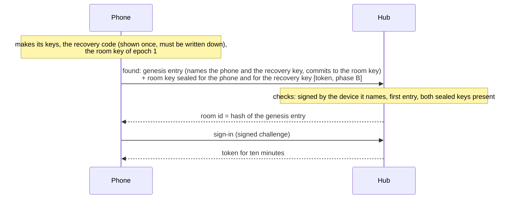
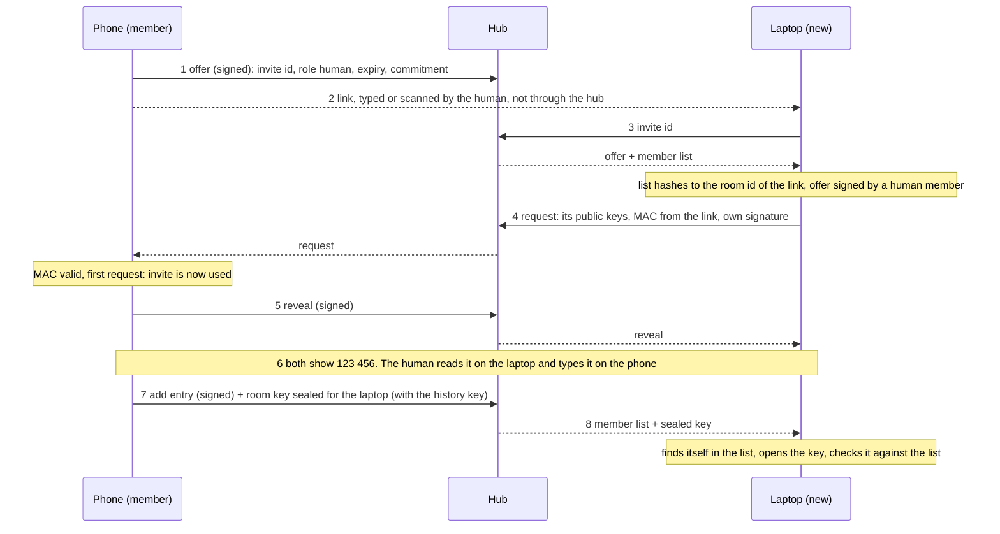
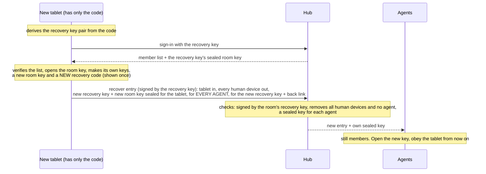

# Pairing: how devices and agents join a room

How the hub and the clients speak when a room is created, a device or an agent joins, a member is removed, and the room is recovered. This is the next step after `docs/krypto-konzept.md` (the design and the decisions of 2 October 2026) and `crypto/FORMAT.md` (the exact bytes). The hub's side exists as a tested module, `crypto/hub.mjs`; it is not wired into `server/server.mjs` yet.

> **In short.** A room is a signed member list. Joining means: a device of the human signs a new line into that list and seals the room key for the newcomer. The hub carries the messages and stores the list and the sealed keys. It cannot add anyone, cannot open any key, and refuses what no member signed. A human compares a six-digit code; an agent joins by a link in its prompt without one.

## 1. Who holds what

| | Holds | Never holds |
| --- | --- | --- |
| A device of the human (phone, laptop, browser) | Its own Ed25519 and X25519 keys, the room key and history key of each epoch, the pinned head of the member list | Another device's private keys |
| An agent (its channel process) | Its own keys in a key file (mode 0600), the room key of each epoch since it joined | The history key; any right to change the member list |
| The recovery code (paper, password manager) | A key pair derived from the code. It can sign exactly one kind of entry: a recovery | |
| The hub | The member list (signed entries), sealed room keys, open invites, sealed envelopes, session tokens | Any private key, any room key, the secret in an invite link, the recovery code |

Every key is Curve25519: Ed25519 to sign, X25519 to agree. There is one room key per epoch, and a new epoch starts only when a member is removed (a recovery removes members, so it starts one too).

## 2. What the hub sees and stores

| The hub stores | It can read | It cannot |
| --- | --- | --- |
| Member list entries | Who is a member, role (human or agent), the device name, both public keys, when, who signed | Forge or reorder an entry: each is signed and chained; the room id is the hash of the first |
| Sealed room keys, one per member and epoch, one per epoch for the recovery key | The recipient, the epoch, and from the length whether a history key is inside | Open them |
| Back links (each room key's way back to the one before) | The epoch | Open them. It hands them to human devices and the recovery key only |
| Invites: the signed offer, up to four requests, the reveal | Invite id, role, expiry, the inviter, the newcomer's public keys and name | The secret behind the `#`; therefore no valid request of its own |
| Envelopes | Sender, recipient, numbers, hashes, time, size (padded); for cards: **card id, status (open, answered, closed), urgency, answer time**; attachment ids; the push bit | Text, options, the chosen option, status lines, file names. It cannot change what it reads: the header is signed |
| Session tokens | Which device is connected, from which address | |

Answered cards: 30 days after the answer the hub deletes the ciphertext of every envelope of that card and keeps header, hash and signature (about 300 bytes each), so the chains still verify. Speech (dictation, reading aloud) goes through the hub and is not end-to-end encrypted: the hub sees that audio and text. The Tinfoil key stays on the hub.

## 3. The invite link

```
https://<app>/join#v1.<hub>.<room>.<secret>
```

| Part | What | Size |
| --- | --- | --- |
| `<app>` | The fixed address the web client is served from. Not the hub. | |
| `v1` | Link version, first, so that a later format can be told apart | |
| `<hub>` | The hub's address (`https://…`), UTF-8, base64url, because addresses contain dots | |
| `<room>` | The room id: the hash of the first entry of the member list. With it the newcomer checks the whole list without trusting the hub | 32 bytes, base64url |
| `<secret>` | Random, made by the inviting device | 32 bytes, base64url |

Everything after `#` stays in the browser; it is never sent to the app's server or to the hub. From the secret both sides derive (HKDF, salt = room id) the **invite id** (16 bytes; the only thing the hub learns) and a **MAC key**. The role (human or agent) is not in the link: it is in the signed offer and under the MAC, so a link for an agent cannot be turned into a human device.

A link works for one newcomer and for ten minutes. Both limits are enforced by the inviting device; the hub enforces them as well, but nobody has to rely on that.

## 4. The messages

All of them are byte strings from `crypto/FORMAT.md`; the transport (JSON over HTTPS) carries them as base64url. The names in the right column are the functions of `crypto/hub.mjs` that the server routes will call.

| # | From → to | Message | Signed by | The hub checks | Hub function |
| --- | --- | --- | --- | --- | --- |
| 0 | device → hub | Sign-in: the hub's 32 random bytes, with room id and hub address | the device key (or the recovery key) | signature against the member list; the challenge is its own, unused, under two minutes old. Gives a token for ten minutes | `challenge`, `signIn` |
| 1 | inviter → hub | **Offer**: room, invite id, role, expiry, a commitment to a hidden number, the list head the inviter knows | the inviting device | signed by an active human member, who is the caller; not expired; at most 16 open invites | `postInvite` |
| 2 | inviter → newcomer | The **link**, copied by the human. Not through the hub | | | |
| 3 | newcomer → hub | Asks for the offer and the member list by invite id | | the invite exists, is open | `invite` |
| 4 | newcomer → hub → inviter | **Request**: its two public keys, name, role, hub address, hash of the offer; a MAC with the link's key; its own signature | the newcomer's new key, and the MAC | form, self-signature, that it names this invite and role, that the key is no member; at most four per invite. It cannot check the MAC | `postRequest`, `requests` |
| 5 | inviter → hub → newcomer | **Reveal**: the hidden number, the hash of the request it answers | the inviting device | signed by the inviter, names a request the hub holds; only one reveal per invite | `postReveal`, `joinStatus` |
| 6 | human | Compares the **check code** (section 5). Skipped for an agent | | | |
| 7 | inviter → hub | **Add entry** for the member list, naming the invite id, plus the **room key sealed** for the newcomer | the inviting device | the entry verifies against the list; it adds exactly the device the inviter answered, in the invited role; the sealed key is there and has the right size for the role | `postEntry` |
| 8 | newcomer ← hub | The longer member list and its sealed key | | | `joinStatus`, then `log`, `wraps` |

What each side verifies itself, whatever the hub did:

- **Newcomer, before it sends anything:** the member list hashes to the room id in the link; the offer is signed by a human member of that list; the offer belongs to this link's invite id.
- **Inviter, on the request:** the MAC (only someone with the link can make it); room, invite, role, hub address and offer hash match; the invite is unused and not expired. It answers the **first request with a valid MAC** and no other. Junk without a valid MAC does not use up the invite.
- **Newcomer, on the reveal:** signed by the inviter; it answers *this* request (otherwise someone else used the link: stop and say so); the number matches the commitment in the offer.
- **Newcomer, at the end:** the list, verified again up to the room id, names its own key in the invited role; the sealed key opens and matches the commitment in the list.

## 5. The check code

```
check code = six decimal digits from
             H("trommi/v1/invite-code", offer ‖ request ‖ hidden number)
```

It covers everything that crossed the hub: who invites, into which room and role, and the newcomer's keys. The inviter fixed its number in the offer before it saw the request (commit, then reveal), so nobody can try keys until the code fits. Six digits leave an attacker one chance in a million per attempt, and each attempt uses up an invite.

**How it is shown and compared.** Both devices show the code after step 5. The human reads the six digits on the **new** device and **types** them on the device that invited. Typing, not tapping "matches": a tap is given without looking. If the digits differ, the inviting device writes nothing and the invite is spent. The human has five minutes; after that the invite is void.

**For humans the code is mandatory.** The library has no switch for it: an add entry for a human role is not produced without `codeConfirmed`.

**An agent that joins by a link in its prompt needs no code.** The human pastes the link into the agent's prompt; the channel process beside the agent joins with it. There is nobody at that end to read digits, and asking the model to read them back would prove nothing. Why this is acceptable:

- The link itself is the proof. The request carries a MAC that only a holder of the link can make. The hub never sees the secret, so the hub cannot join, and it cannot swap the keys in the request.
- An agent link gives an agent, never a device that may give commands or change members. Agents get no history key.
- The link works once and for ten minutes. If someone else used it first, the real agent is told "this invite was answered for another device" and reports it; the human removes the stranger with one tap, which also changes the room key.
- The inviting device shows who joined ("Agent *Crypto* joined, key `ab12 cd34`") and the human can remove it at once.

What it risks, plainly: **whoever sees the link within ten minutes and is faster than the agent joins as an agent.** The link passes through the agent's prompt, so it is in Claude Code's transcript and goes to the model provider; a shared terminal, a pasted log or a clipboard manager can leak it too. Such a stranger reads the room from then on, and, because a room key now lasts until someone is removed, could read back to the last removal if the hub gave it the old envelopes. It cannot give commands, cannot add or remove anyone, and is gone as soon as it is removed. Without the check code there is also nothing that ties the joined key to the process the human meant, other than "it had the link".

For an agent the human can still compare the code if the agent's side can show it (a terminal the human sees): the code is computed either way. It is just not required.

## 6. An agent's stable id, its instance, and its member key

Today an agent has a readable id (the slug of its name: `crypto`, `crypto-2`) and an `instance` (a random number per process); a process that comes back gets its id only if it names the same instance. With keys this becomes:

| | Is | Lives |
| --- | --- | --- |
| **Member key** | The agent's identity: an Ed25519 and an X25519 key pair. Its hash is the device id in the member list | Key file in the channel process's data folder, mode 0600, one per room: `keys/<room id>.key` (66 bytes, `crypto/FORMAT.md` section 4) |
| **Stable id** (`crypto`) | The board's name for that member, used in addresses and by the other clients. The hub binds it to the member key the first time the agent signs in, and gives **the same id to the same key** ever after, whatever name the process gives | Hub: a row device → session id |
| **Instance** | One running process. It no longer proves identity. It only tells two processes with the same key file apart | Process memory |

- A process starts, finds its key file, signs in with the key (message 0) and claims its session (`claimSession`): it gets its old id back. No key file: it needs an invite link.
- A second process with the same key file while the first is connected is **refused** (`instance-conflict`), as today's 409. Two processes under one key would write two histories under the same numbers, which every client reports as a forgery.
- When an agent is removed, its id is not handed to anyone else. A new agent with the same name becomes `crypto-2`.
- A lost key file means a new invite and a new identity. The old member stays in the list until a human removes it.
- The name in the member list is what the agent called itself when it joined. It is readable by the hub; a session's later name, task and status are content and are not.

## 7. Today's token login during the transition

Today one shared token (cookie, `?t=` link, `x-board-token` for agents on the same machine) opens everything. It cannot go away in one step, because the web client, the agents and the server change at different times.

| Phase | The hub accepts | Content | What changes for the human |
| --- | --- | --- | --- |
| **A, today** | the token | plaintext | nothing |
| **B, both** | the token **or** a signed sign-in, on every route | plaintext, and signed where the client can | The first device that supports keys founds the room (it must hold the token to do so) and shows the recovery code. Further devices and agents join by invite. The board shows per member whether it has a key or still uses the token |
| **C, keys only** | signed sign-in. The token is refused for everything except the admin page on the hub's own machine | ciphertext | Switched on by the human on the admin page, once every device and agent has a key. Token links stop working |

Rules for phase B, so that it does not weaken what is already signed: the member list and the sealed keys are served to signed sessions only, never to the token; an entry for the member list is accepted on its signature alone, the token adds nothing to it; a room is founded once, and only by someone holding the token (`found` trusts its caller on this). The token stays what it is today: full access to everything that is still plaintext.

## 8. The five sequences

### 8.1 The first device creates the room



Without a recovery code no room: the genesis entry has no form for "none".

### 8.2 A second device joins



### 8.3 An agent joins by a link pasted into its prompt

```mermaid
sequenceDiagram
  participant P as Phone (member)
  participant H as Hub
  participant C as Channel process of the agent
  P->>H: 1 offer (signed): role agent
  Note over P: shows the link; the human pastes it into the agent's prompt
  C->>H: 3 invite id
  H-->>C: offer + member list
  Note over C: makes its keys, writes the key file (0600), verifies list and offer
  C->>H: 4 request
  H-->>P: request
  P->>H: 5 reveal
  Note over P: no check code. Shows "Agent Crypto joined", with Remove beside it
  P->>H: 7 add entry + room key sealed for the agent (no history key)
  H-->>C: 8 member list + sealed key
  C->>H: sign-in, claim session
  H-->>C: stable id "crypto"
```

The inviting device must be online for steps 4 to 7. The agent waits (it polls `joinStatus`) until the invite runs out.

### 8.4 A device is removed

```mermaid
sequenceDiagram
  participant L as Laptop (any human device)
  participant H as Hub
  participant O as Everyone who stays
  participant X as Removed device
  Note over L: makes a new room key (epoch n+1)
  L->>H: remove entry (signed; carries the new epoch) + the new key sealed for each who stays,<br/>agents included, and for the recovery key + back link
  Note over H: checks: signed by an active human member, one sealed key per remaining member,<br/>none for the removed one
  H--xX: connections cut, token dead, no sign-in any more
  H-->>O: new entry + own sealed key
  Note over O: verify the entry, open the key, send in the new epoch from now on
```

Any device of the human may do this, also to the device that founded the room. The removed device keeps what it already had and gets nothing new. Removal and the new key are one entry; one cannot happen without the other.

### 8.5 Recovery



The agents are not invited again. The old devices are out even if one turns up later; the old code is spent. A device that had already seen a different continuation of the list is told that a recovery overrode it; that is shown, never applied silently.

## 9. Failure cases

| What happens | Who notices | What the human sees | Code |
| --- | --- | --- | --- |
| The link is opened after ten minutes | newcomer, inviter, hub | "This invite has run out. Make a new one." | `invite-expired` |
| A second device uses the same link | inviter (answers only the first), hub | On the late device: "This invite was already used by another device." If the first was not yours: remove it | `invite-used`, status `taken` |
| The hub (or anyone without the link) swaps the keys in the request | inviter | Nothing joins; the invite stays usable | `bad-mac` |
| The hub serves another member list | newcomer | "This hub shows a different room than the link." | `wrong-room`, `bad-entry` |
| Someone sits in the middle of a human join | the human, at the code | The digits differ. The inviting device adds nobody | `code-not-confirmed` |
| The human waits more than five minutes with the code | inviter | "Too late, make a new invite." | `invite-expired` |
| The inviting device goes offline before step 7 | newcomer | Waits, then "The invite ran out before it was confirmed." | status `waiting`, then `invite-expired` |
| The hub withholds the sealed key or the entry | newcomer | Stays at "waiting"; cannot be told from an offline inviter | |
| The sealed key holds another key than the list commits to | newcomer | "The room key does not match the member list." | `key-mismatch` |
| An entry that no current human member signed | hub, every client | Refused at the hub; a client that gets it anyway stops and reports | `bad-entry`, `bad-signature` |
| A removed member signs in, posts an envelope or an entry | hub, every client | Refused | `not-member`, `removed-sender`, `bad-entry` |
| An old entry or envelope is sent again | hub, every client | Refused | `replay` |
| Two devices change the list at the same moment | hub | The second is refused; its device fetches the list and tries again | `bad-entry` (wrong predecessor) |
| A removal without a sealed key for someone who stays | hub | Refused: nobody may be locked out by accident | `incomplete` |
| The hub rolls the list back or shows two devices different lists | the devices (pinned head; every envelope names the head its sender knows) | "The hub shows an older or a different member list." | `log-rollback`, `log-fork` |
| A second process starts with the same agent key file | hub | The second one is refused | `instance-conflict` |
| The agent's key file is lost | | New invite, new identity; remove the old member | |
| All devices lost, code at hand | | Recovery (8.5) | |
| All devices and the code lost | | The room is lost. A new room, agents invited again | |
| A wrong recovery code is typed | new device | "This code does not belong to the room." | `bad-recovery-code` |

## 10. Open points

- **A new agent can read back to the last removal.** The room key changes only on removal, so an epoch can be months long, and a joining agent gets that epoch's key. If new agents should not read earlier messages, adding an agent would have to start a new room key as well. That is a choice for the human.
- **Device names are readable by the hub** (they are in the member list). If they should be hidden, the list would carry only keys and the names would travel as encrypted content.
- **The store's member tables** (`server/store/store.mjs`: `member_log`, `devices`, `wrapped_keys`, `invites`) predate the decisions: `member_log.kind` knows `epoch` but not `recover`; an entry changes one device, while a remove or recover entry changes several; there are no methods for invites, back links or the device → session binding. `crypto/hub.mjs` therefore runs on `memoryStorage()`, whose fifteen methods are the list of what the store has to offer.
- **Routes.** `crypto/hub.mjs` has no HTTP. The functions in section 4 map one to one onto routes; the SSE stream needs the token in a header (`fetch`, not `EventSource`).
- **Not verified:** whether Safari keeps a non-extractable X25519 key in IndexedDB reliably (concept, section 13).
