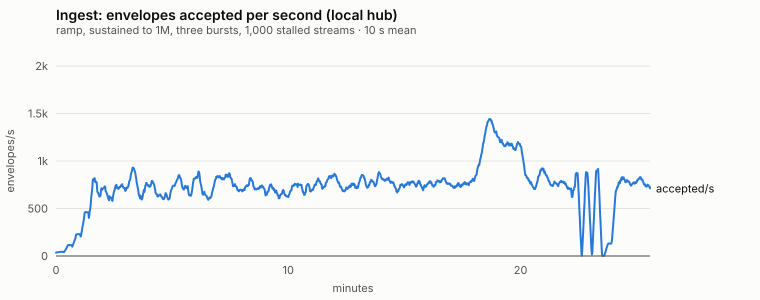
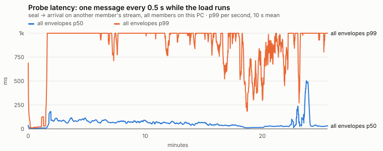
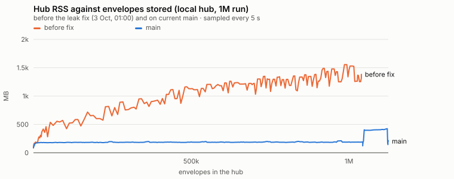
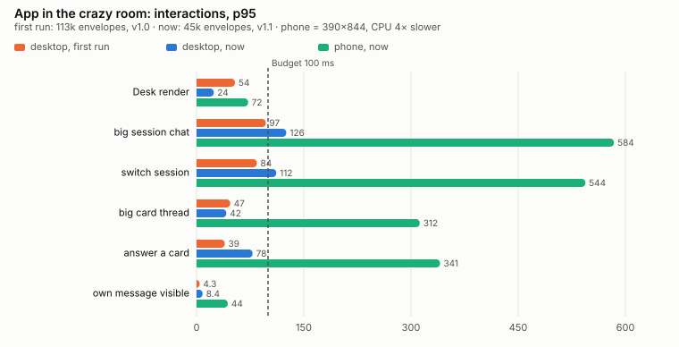

# Performance, night of 3 to 4 October 2026

Load, speed and memory of the thin hub (`hub/`), the client core (`core/`) and the app (`trommi/trommi`), measured with real members: every simulated agent and human is a client/core client with its own device keys, joined by a real invite (humans with the six-digit check code), sending sealed, chained envelopes over HTTP. Nothing is mocked except the people.

**Local or live?** Every table says where it ran.

- **local** means the real hub code (`dev/e2e/hub-local.mjs` starts `hub/server.mjs`) on this PC (24 cores, 93 GB), with server metrics every 5 s. Only the public-abuse limits are lifted there: founding per IP, streams per device, envelopes per second.
- **live** means `https://hub.trommi.com` (Hetzner, 4 vCPU, 8 GB, behind a Cloudflare Tunnel), measured from this PC. Live runs have client-side numbers only: SSH to the server needs Christopher's interactive approval, and the hub's metrics port is not mapped yet.

## Results against the budgets

| Budget | Result | Where |
| --- | --- | --- |
| Hub memory flat under load, no OOM or restart | **pass** after the fix: RSS 160-220 MB from 0 to 1.18M envelopes (before the fix: 1.6 GB at 1M, growing) | local |
| 1,000 stalled streams do not hurt others | **pass** after the fix: hub RSS 177 → 212 MB, the probe p99 89 ms (before the fix: 5 GB RSS, event loop stalled for minutes) | local |
| Delivery p99 (no fixed budget) | run v1.1: p99 5-24 ms up to 900 envelopes/s, 621 ms sustained at 1,762/s, the probe p99 38 ms. Run final (current main, shared PC): p99 about 1.1 s from about 800/s on (backpressure retry-after 1 s) | local |
| Delivery, live | p50 43-46 ms (the Cloudflare round trip), p99 61-114 ms at light load | live |
| Catch-up of a fresh device after 1M | 1.18M envelopes in 141 s (8,400/s incl. HTTP; 17,000/s processing) | local |
| Thread paging: one index hit, chat only | **pass**: `SEARCH envelopes USING COVERING INDEX envelopes_by_timeline`, 40 chat items next to 10,000 strokes, `GET threads` 1 ms | local |
| Removing a member, 20+ members | crypto 3-14 ms; the whole removal 1.7-2.3 s in v1.1 (one grant per session) | local |
| App interaction < 100 ms | desktop: v1.0 **pass**, v1.1 nearly (session chat p95 126 ms, switch 112 ms); phone (CPU 4×) **fail**: session chat, switching sessions, card thread, answer (p95 290-580 ms) | local hub, app :8900 |
| App first load of a big room | v1.1 with the snapshot: 2.4 s desktop, 3.4 s phone (45k envelopes); v1.0 without it: 29 s / 86 s (113k). But after a snapshot join no chat history shows (**fail**, functional) | local |
| Own send visible < 50 ms | **pass**: p95 8.4 ms desktop, 43.6 ms phone (v1.1) | local |
| No long task > 200 ms | desktop **pass**; phone **fail**: v1.1 interactions 4 tasks over 200 ms (max 501 ms); v1.0 first load max 897 ms | local |

## Method

Tools, all in `dev/e2e/` (run them from the repository root):

| File | What it does |
| --- | --- |
| `load.mjs` | The load generator. It founds a dedicated room and adds 20+ agents and several humans by invite. Worker processes (`worker.mjs`) send a realistic mix through the core's own API: chat, cards, revisions, card chat, status lines, attachments and strokes from agents; answers, chat, strokes, read markers and drafts from humans. Then it runs the phases below. |
| `hub-local.mjs` | The real hub on a free port 8891-8899, with metrics every 5 s: process CPU, RSS, heap, event-loop delay, open sockets, bytes queued in sockets, hub.db + WAL size. |
| `crazy.mjs` | Seeds the "crazy" room: 32 sessions with status lines, answered and open cards (half revised), a big session chat, a big card thread, desk and session canvases (one canvas much bigger than the rest). |
| `app-perf.mjs` | The app in headless Chromium over CDP against that room. A seeded human device invites the browser, which joins with the check code; then it measures desktop and phone (390×844, CPU 4× slower). |
| `rotation.mjs` | Removing members in a room of 27 live members. |
| `charts.mjs` | The SVG and PNG figures below. |

**Phases of `load.mjs`:**
- **ramp:** a per-member rate in steps until ingest stops growing.
- **sustain:** until the room holds 1M envelopes.
- **burst:** three times 15 s at full speed with deeper queues.
- **stall:** 1,000 streams that stop reading, while the room keeps sending.
- **catchup:** a new human device (memory storage) joins and catches up everything.
- **paging:** it pages the biggest chat back, 50 at a time.
- **chatstrokes:** one session gets 40 chat messages and 10,000 strokes; then its chat is opened.

**Latency:**
- **Delivery:** the time from the signed header time to the moment the envelope arrives on an observer's stream. The observer is a human device; all members run on this PC, so there is one clock.
- **Probe:** an extra agent sends one message every 0.5 s with an empty outbox. That is what a person beside the load feels.

The core's outbox posts one envelope at a time per device, so throughput grows with the number of members. Locally it is bound by the client processes, not by the hub: the hub sat at 50-110 % of one core.

Memory: senders run without a live stream, on a lean storage adapter that keeps no thread bodies. Echoes are dropped once the hub confirms an envelope, so one process can host many members for an hour. Observers keep every live item they see; `trimWindows` keeps that bounded.

## Hub under load (local)

Run "v1.1" on this PC: 25 members (20 agents, 3 humans, an observer, the probe), 8 worker processes, 4 October 01:30 UTC. Hub code: v1.1 with the leak fix, sliced catch-up and the stream-buffer cap (`hub-v11`, merged as 691ecc4).

| Phase | Ingest | Delivery p50 / p95 / p99 | Probe p50 / p99 |
| --- | --- | --- | --- |
| ramp 2/s per member | 45/s | 2 / 3 / 7 ms | 2 / 4 ms |
| ramp 10/s | 230/s | 2 / 3 / 7 ms | 2 / 13 ms |
| ramp 40/s | 918/s | 2 / 4 / 24 ms | 2 / 32 ms |
| ramp max | 2,826/s | 27 / 70 / 287 ms | 7 / 34 ms |
| sustained to 1M (489 s) | 1,762/s | 31 / 96 / 621 ms | 8 / 38 ms |
| burst (3 × 15 s, max) | 1,049-1,284/s | 110-181 / 242-381 / 933-1,221 ms | 4-5 / 21-40 ms |
| 1,000 stalled streams (120 s) | 1,019/s | 45 / 180 / 767 ms | 9 / 89 ms |

| Measure | Value |
| --- | --- |
| Envelopes in the room at the end | 1,188,156 |
| Hub RSS / JS heap, max over the run | 617 MB / 428 MB (the heap saws between 20 and 430 MB; the end of the run is 217 MB RSS, 24 MB heap) |
| Event loop, worst 5 s window | 109 ms |
| hub.db + WAL | 1,868 MB for 1.19M envelopes = 1.6 KB per envelope incl. indexes (2.3 KB before the BLOB columns) |
| Catch-up of a fresh device | 1,184,378 envelopes in 140.8 s = 8,413/s incl. HTTP; 69.5 s processing (17,000/s); 351,224 heads decrypted; +1.55 GB client memory (memory storage holds every record) |
| Paging the biggest chat (40,760 items), 40 pages of 50 | p50 373 ms, p95 517 ms per page. That is the test client's memory storage: `rangeOf` sorts all keys on every read. The hub side of a page is one index hit (next row) |
| Chat next to 10,000 strokes | `GET threads?timeline_kind=chat` p50 1.1 ms, 40 items, only `timeline_kind` chat; plan `SEARCH envelopes USING COVERING INDEX envelopes_by_timeline (room_id=? AND timeline_kind=? AND timeline_id=? AND envelope_number<?)` |

**Run "final" on current main** (4 Oct 04:09 UTC, same setup). The PC was shared with a 20-worker fuzz run (load average 32 on 24 cores), so the clients were slower: ingest 710-870/s, with the hub at 50-90 % of one core.
- Hub RSS 91-190 MB up to 1M; 424 MB while the 1,000 stalled streams were open; 161 MB after they closed. Heap max 251 MB.
- Event loop worst 101 ms; hub.db 1,771 MB at 1.12M envelopes.
- Latency is worse than in run "v1.1": sustained p50 52 ms, p95 286 ms, **p99 1,151 ms**; the probe p50 19 ms, p99 1,041 ms. Many outliers sit just above 1,000 ms. That matches the hub's new backpressure (`503 overloaded`, `retry-after: 1`), which also refused 199 attachment uploads. It points at the write-queue limit being reached at about 800/s locally (handed to A).
- The catch-up phase of this run was still running when this was written; the catch-up numbers above are from run "v1.1".

| Phase (final) | Ingest | Delivery p50 / p95 / p99 | Probe p50 / p99 |
| --- | --- | --- | --- |
| ramp 10/s per member | 229/s | 7 / 16 / 24 ms | 4 / 11 ms |
| ramp 20/s | 446/s | 8 / 22 / 36 ms | 6 / 18 ms |
| ramp 40/s | 787/s | 26 / 672 / 1,198 ms | 14 / 1,030 ms |
| sustained to 1M (1,202 s) | 792/s | 52 / 286 / 1,151 ms | 19 / 1,041 ms |
| burst | 819-867/s | 28-35 / 946-1,042 / 1,250-1,312 ms | 9-15 / 45-1,017 ms |
| 1,000 stalled streams (120 s) | 654/s | 29 / 501 / 1,450 ms | 15 / 1,113 ms |

Charts (run "final"):  

### What the load test found, and what was fixed tonight

1. **Hub memory leak**, fixed in eb1ef81 (A). `core/hub.mjs` kept every envelope hash of every sender that joined after the room was loaded, in a plain `Map`. Locally the heap grew from 29 MB at 4k envelopes to 429 MB at 319k, and RSS reached 1.6 GB at 1M, still growing. After the fix: RSS stays at 160-220 MB from 0 to 1.18M.

   
2. **Stalled streams**, fixed in 06169e6 (A): sliced catch-up, plus a global cap on stream buffers that drops the fattest streams. Before the fix, 1,000 streams that each started a catch-up of the 1M room and read nothing took the hub to 5 GB RSS: 2.7 GB array buffers and 0.9 GB queued in sockets. The event loop stopped for minutes and the probe saw p50 2.7 s; on the 8 GB server that would be an OOM. After the fix: RSS 177 → 212 MB during the stall, the probe p99 89 ms, and the dropped streams resume by cursor.
3. **Header size and the database**: 600 B headers (the `seen` vector) and hex TEXT columns. Fixed in v1.1: bounded `seen`, BLOB ids and hashes. Also new: incremental auto_vacuum, so deleting test rooms gives space back.

## Live: hub.trommi.com

- **Before the v1.1 cutover** (signed test room, 46 members, 4 Oct 01:13 UTC, then deleted): 89,583 envelopes in 469 s at 191/s. That is the ceiling of 46 serial senders at about 200 ms per POST. Delivery p50 932 ms, p99 1.8 s; the probe p50 194 ms, p99 652 ms. A 100-stream stall phase: 97 opened, 3 refused (per-device limit). The run then hit the cutover wipe (`no-room`).
- **After the cutover** (v1.1, 4 Oct 04:06 UTC, normal room, default limits, no test key, 10 members):

| Phase | Ingest | Delivery p50 / p95 / p99 | Probe p50 / p99 |
| --- | --- | --- | --- |
| 1/s per member | 7/s | 45 / 67 / 114 ms | 43 / 103 ms |
| 2/s per member | 15/s | 46 / 57 / 72 ms | 43 / 61 ms |
| max (8 senders) | 208/s | 163 / 281 / 433 ms | 43 / 64 ms |

| Measure (live) | Value |
| --- | --- |
| Catch-up of a fresh device, 5,205 envelopes | 3.1 s (1,680/s incl. HTTP; 0.8 s processing) |
| Paging a 435-item chat, 50 per page | p50 88 ms, p95 133 ms |
| Chat beside 500 strokes: `GET threads` | p50 44 ms (one round trip), only chat items |

The live floor is the round trip through Cloudflare: about 45 ms (healthz 70-110 ms from this PC). That room (`cd1ef8bf0ed4…`) is a normal room, so it could not be deleted. Signed test rooms are off on prod since the test key was removed.

## Removing a member (20+ members, local)

27 live members (3 humans, 24 agents, each agent in its own session); each removal is one agent.

| | v1.0 (before the cutover) | v1.1 (main) |
| --- | --- | --- |
| Crypto part (`removeMembers`: new epoch, wraps, entry) | 8-12 ms, 27 wraps | 3-14 ms, 4 wraps (humans and recovery only: agents hold no room key) |
| The whole call (`removeDevices`) | 12-17 ms | 1,653-2,272 ms (it rotates every session key: one grant per session, 24 sessions) |
| Until every remaining member is in the new epoch | 33-38 ms | same as the call |
| First card in the new epoch reaching a human | 21-22 ms | 1,045-1,355 ms |

## The app in the crazy room (local hub, app from the dev server)

Room A, v1.0 core, before the cutover: 113,112 envelopes.
- 32 sessions with status lines and 5,000 answered cards (half revised), plus 300 open cards.
- 50,000 chat messages, among them a session chat of 2,500 and a card thread of 2,000.
- 50,000 strokes, one desk canvas of 20,000.

| Interaction, p50 / p95 ms | desktop, first run | desktop, after C's fix | phone (CPU 4×), after the fix |
| --- | --- | --- | --- |
| First load (join → live, 113k envelopes) | **366.7 s**, longest task 138 s | 29.0 s, longest task 139 ms | 86.3 s, 47 long tasks, longest 897 ms |
| Warm reload → Desk painted | 330 / 357 | 294 / 329 | 702 / 758 |
| Warm reload → live | 457 / 469 | 410 / 433 | 1,044 / 1,131 |
| Desk render | 32 / 54 | 5.6 / 24 | 25 / 26 |
| Open the huge session chat | 82 / 97 | 48 / 80 | **211 / 292** |
| Earlier page (scroll back) | 16 / 45 | 6.6 / 31 | 20 / 91 |
| Type + send, own message visible | 3.5 / 4.3 | 2.9 / 3.1 | 10.8 / 15.4 |
| Switch session | 78 / 84 | 57 / 91 | **221 / 318** |
| Open the huge card thread | 37 / 47 | 18.5 / 20.5 | 60 / 81 |
| Answer a card on the Desk | 37 / 39 | 18 / 27 | not measured (selector) |
| A stroke through the core (echo) | 0.2 | 0.1 / 0.2 | 0.3 / 0.8 |
| Long tasks during interactions | 0 | 0 | 7, max 68 ms |
| JS heap / IndexedDB | 120 MB / 35 MB | 138 MB / 37 MB | 215 MB / 33 MB |

The first load took 367 s because of the Desk controller: an IntersectionObserver callback ran Stimulus target lookups (`querySelectorAll`) and `getBoundingClientRect` for every row, on every catch-up batch. That was 83 of 90 profiled seconds. C fixed it in cc891d3 (367 s → 29 s). The canvas tail without a snapshot (`loadTimelineAfter` over the 20,000-stroke canvas) takes 6.8 s on desktop and 19.8 s on the phone: the pad must start from a canvas snapshot.

**Room B, v1.1 core with the room snapshot** (current main, 40 % scale because of the human send cost below): see the next table.

45,345 envelopes: 32 sessions, 2,000 answered + 120 open cards, 20,000 chat messages (a session chat of 1,000, a card thread of 800), 20,000 strokes (canvas 8,000). Before the browser joins, the seeded device writes a room snapshot (1.07 MB, 307 ms).

| p50 / p95 ms | desktop | phone (CPU 4×) |
| --- | --- | --- |
| First load (join → live) | **2.4 s** (snapshot read 164 ms), 4 long tasks, max 123 ms | **3.4 s** (snapshot 282 ms), 10 long tasks, max 147 ms |
| Warm reload → Desk painted / → live | 389 / 491 · 1,090 / 1,103 | 1,402 / 1,972 · 3,285 / 4,537 |
| Desk render | 14 / 24 | 51 / 72 |
| Open the big session chat | 112 / 126 | **556 / 584** |
| Switch session | 70 / 112 | **440 / 544** |
| Open the big card thread | 26 / 42 | **168 / 312** |
| Answer a card on the Desk | 39 / 78 | **122 / 341** |
| Type + send, own message visible | 4.2 / 8.4 | 17.9 / 43.6 |
| Long tasks during interactions | 3, none > 200 ms | 45, 4 > 200 ms (208, 329, 371, 501) |
| JS heap / IndexedDB | 22 MB / 5 MB | 21 MB / 6 MB |

**Functional gap found with this run:** after a join through the snapshot, no session chat and no card thread shows its history within 30 s, and "Earlier" loads nothing. Only new messages appear (handed to C and B). Also, the phone got slower than on the v1.0 core for sessions, threads and answers.



## Gaps handed on

- **App, v1.1** (C, B): after a snapshot join no history in chats or card threads. On the phone, opening a session, switching sessions, card threads and answers take p95 290-580 ms.
- **Hub backpressure** (A): on current main the probe's p99 is about 1.1 s from about 800 envelopes/s on (local), with outliers just above the 1 s retry-after.
- **Core** (B): on v1.1 a human device that holds about 5,300 cards spends about 90 ms of CPU per own envelope in Node. 5,000 answers took 396 s, against 39 s on v1.0. Some per-send work seems to grow with the number of cards.
- **Core / channel** (B, D): removing one agent rotates every session key (1.7-2.3 s with 24 sessions); only the removed agent's sessions need a new key.
- **Hub** (A): with the attachment write queue under load, uploads see `503 overloaded` (63 of about 1,300 in the final run). The core retries them, but the load generator counts them.

## Needs Christopher's go (morning)

- Server metrics: `METRICS_PORT` in `/srv/trommi/compose.yaml`, mapped to 127.0.0.1, plus SSH approval for reading `docker stats`.
- A test public key on prod (`HUB_TEST_PUBLIC_KEY`) for signed test rooms. That allows large live runs that delete themselves. The 1M run on prod only after that, and with backups that skip test rooms.
- Deleting the normal live room `cd1ef8bf0ed4…` (5,846 envelopes).

## Reproduce

```bash
node dev/e2e/load.mjs --hub=local --total=1000000 --agents=20 --humans=3 --workers=8 --stalled=1000 --out=/tmp/load-1m
node dev/e2e/load.mjs --hub=https://hub.trommi.com --total=5000 --agents=6 --humans=2 --rate=2 --phases=ramp,sustain,catchup,paging,chatstrokes --out=/tmp/load-live
node dev/e2e/rotation.mjs --hub=local --agents=24 --removals=5
node dev/e2e/crazy.mjs --hub=local --keep-hub --out=/tmp/crazy        # then, with the app on :8900 (sandbox off for Chromium):
node dev/e2e/app-perf.mjs --crazy=/tmp/crazy --app=http://127.0.0.1:8900 --runs=5
node dev/e2e/charts.mjs --out=docs/perf --run=/tmp/load-1m,local-1m
```

With a signed test key (`--test-key=<file>`) the generator founds a test room on the live hub and deletes it at the end.
