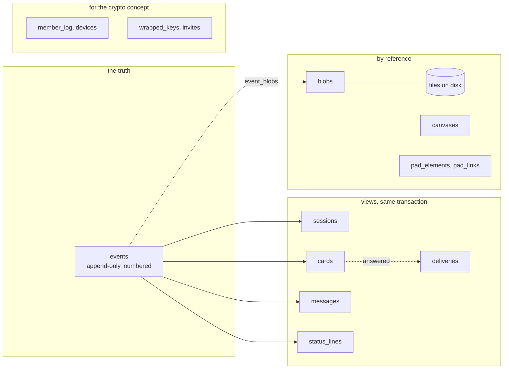

# Storage

The next storage layer for the hub. Status on 2 October 2026: built and tested as a standalone module in `server/store/`, **not wired into `server.mjs`**. This page is the data model and the reasoning; the API and the switch-over plan are in `server/store/README.md`.

> **In short.** One SQLite file per room. An append-only **event log** is the truth: every message, every step of a card, every status line is one row with a room sequence number, a per-sender number and a client id. Beside the log sit small **views** (sessions, cards, status lines, the delivery queue) that the server needs to answer quickly and to delete after 30 days; they are updated in the same transaction as the event that changes them. Content is **opaque bytes**: plaintext JSON today, ciphertext later, without a change of schema. Files stay files and are recorded by reference.

## Why change

Today the whole state is one object in memory, written as one JSON file and sent in full to every open page on every change (`commit()` in `server.mjs`). That is simple and it works at today's size (68 KB). It does not carry what `docs/gelernt.md` and `docs/krypto-konzept.md` ask for:

| Needed | Today |
| --- | --- |
| Every message with a sequence number and a client id, so nothing arrives twice | Messages have a random id; a retried POST is a second message |
| A client that was away fetches what it missed | It gets the whole state again; cost grows with the history |
| The hub stores ciphertext plus the few readable fields it needs | The hub reads and rewrites everything |
| A write is all or nothing | `decide()` commits the card, then queues the notification; a crash between the two loses the notification |
| Single pad elements can be addressed and sent | One JSON document per canvas |

Measured on this machine: rewriting a 6.8 MB state file takes about 15 ms per change (RAM disk, no fsync), and the same 6.8 MB go to every open page each time.

## The model

All times are Unix milliseconds. All ids are text unless noted. `payload BLOB` with an `enc` column beside it is content the server stores without looking: `enc = 0` plaintext JSON, `enc = 1` a sealed envelope as in the crypto concept, section 5.

### One room, one file

A database file holds exactly one room. The room's sequence number is then simply the primary key of `events`, deleting a room is deleting a file, a backup is a copy, and no query can ever cross tenants. Today there is one room. With Postgres the same model would carry a `room` column in every key instead.

### events: the log

| Column | Type | Meaning |
| --- | --- | --- |
| `seq` | INTEGER PRIMARY KEY | The room sequence, 1, 2, 3 … without holes. Rows are never deleted, so the next number is always the highest plus one. **This is the cursor.** |
| `sender` | INTEGER → `senders.n` | Who appended: a session id, `human`, `hub`, `import`; later a device from the member list |
| `sender_seq` | INTEGER | The sender's own count, 1, 2, 3 … A sender that numbers its messages itself (signed envelopes) must continue exactly; a gap or a repeat is refused |
| `client_id` | TEXT | Chosen by the client, for idempotency. Under the crypto concept: device id plus `sender_seq` |
| `type` | TEXT | `message`, `card.asked`, `card.answered`, `card.reopened`, `card.closed`, `card.withdrawn`, `card.expired`, `card.urgency`, `card.note`, `status.set`, `status.cleared`, `session.joined`, `session.updated`, `session.forgotten`, `canvas.saved`, `pad.put`, `pad.deleted`, `pad.sent`, and free types the store keeps no view of (`note`) |
| `session` | TEXT → `sessions.id`, null | The conversation the event belongs to, which is also its recipient. Null: for the whole room |
| `card_id`, `card_status`, `answered_at` | TEXT, TEXT, INTEGER | The card metadata the crypto concept keeps readable: which card, its status after this event, when it was answered |
| `ref` | TEXT | What else the event is about: message id, status line id, session id, pad element id |
| `push` | INTEGER | The one bit "send a push notification" |
| `created`, `sent` | INTEGER | Server time of receipt; the sender's own clock, if given |
| `enc`, `epoch` | INTEGER | Encoding of the payload; key epoch (0 while plaintext) |
| `payload` | BLOB, null | The content. Null after a purge |
| `size`, `hash` | INTEGER, BLOB | Length and SHA-256 of the payload; both stay after a purge, so a hash chain is not broken |
| `prev_hash`, `sig` | BLOB | The sender's previous envelope and its signature; empty until step 4 of the crypto plan |
| `purged_at` | INTEGER, null | When the payload was deleted |

Keys and indexes: `UNIQUE (sender, client_id)` is the idempotency rule; `UNIQUE (sender, sender_seq)` makes a replayed number impossible and serves gap-filling per sender; `(session, seq)` pages one conversation; a partial index on `(card_id, seq)` finds a card's events for the purge.

`senders (n INTEGER PRIMARY KEY, id TEXT UNIQUE, last_seq)` interns sender names and holds each sender's counter.

### sessions (the agents)

| Column | Meaning |
| --- | --- |
| `id` PRIMARY KEY | The stable id (`storage`, `web-ui-2`) |
| `instance`, `online`, `connected`, `seen` | Presence. Not logged as events: who is online is only true while the hub runs |
| `archived` | Plaintext, because the stack leaves out the questions of an archived session |
| `joined`, `forgotten_at` | A forgotten session stays as a tombstone, so the log's rows keep something to point at |
| `messages` | Counter, kept in step, so a snapshot never counts rows |
| `profile`, `profile_enc`, `profile_seq` | Name, label, icon, group, model, program, task, folder, machine, star: one opaque value, and the event that last changed it |

### cards: a view of the card events

A card is what its events made it. The row holds only what the server needs to sort the stack, to refuse an illegal step and to delete after 30 days; the question, the options, the answer and the summary stay in the payload of the event that carried them.

| Column | Meaning |
| --- | --- |
| `id` PRIMARY KEY, `session`, `number`, `kind` | Owner, the running number shown to the human, `decision` or `permission` |
| `status` | `open`, `decided`, `done` |
| `closed_as` | How it ended: `closed` (the agent acted), `withdrawn`, `expired` (approval whose session ended), `answered` (approval) |
| `urgency` | `low` … `critical`, or **null if urgency is hidden** (open decision 5 of the crypto concept); then the server orders by age and the client sorts |
| `request_id` | For approvals: one card per request |
| `created`, `answered_at`, `closed_at` | `answered_at` drives the purge |
| `ask_seq`, `answer_seq`, `close_seq`, `urgency_seq`, `last_seq` | Pointers into the log: where the content is |

Indexes: `(session, number)`, `(status, created)`, `(number)`.

Legal steps, everything else is refused and leaves no trace:

| Step | Allowed when | Result |
| --- | --- | --- |
| ask | the session exists; an open approval with the same request id returns that card | `open` |
| answer | `open`; while the question is plaintext, the choice must be one of its options | decision: `decided`; approval: `done` (`answered`). Status lines that waited on the card turn to `working`. The notification for the agent can be queued in the same transaction |
| reopen | a decision that is not open and was answered | `open`; answer and summary pointers cleared |
| close | by the owning session; not an open approval | `done` (`closed`) |
| withdraw | by the owning session; an open decision | `done` (`withdrawn`) |
| set urgency | by the owning session; an open decision | level and reason changed |
| expire | an open approval | `done` (`expired`) |

These are today's rules from `runTool`, `decide` and `reopen`, including the two lenient ones: an open decision may be closed by its agent, and a closed card that had an answer may still be reopened.

### messages

`messages (id PRIMARY KEY, seq UNIQUE → events, session, origin 'user' | 'agent', created)`, index `(session, seq)`. A thin index over the `message` events: the text, details, attachments and asset link are the event's payload. A conversation as the page shows it, with the cards in place, is `events` filtered by `session`; the separate marker messages of today (`from: 'event'`) are no longer stored, because the card events themselves stand where the markers stood.

### status_lines

`status_lines (session, id, state, card_id, updated, seq, payload, enc)`, primary key `(session, id)`. Label and detail are the payload. `state` and `card_id` are plaintext **for now**, because the hub turns a waiting line yellow when its card is answered; once clients build the state themselves (step 2 of the crypto plan) that rule moves to the client and both columns can go into the payload.

### deliveries: what waits for a session that is away

`deliveries (id AUTOINCREMENT, session, method, params, enc, event_seq, dedupe UNIQUE, created, handed_at, attempts)`, indexes `(session, id)` and `(created)`.

Enqueue, hand over, acknowledge. Handing over does not remove an entry; only the acknowledgement does. An entry that was handed over when the link or the hub died is handed over again, and `attempts` says so. At most 100 per session, the oldest give way, as today. This table is a bridge for today's channel notifications: once an agent's channel process reads the log like any other client, a session's queue is just its cursor.

### blobs: files by reference

Attachments, assets, scribbles, canvases, pad images and voice notes stay files in the data directory. The database knows them, never contains them.

| Column | Meaning |
| --- | --- |
| `id` PRIMARY KEY | For imported files the relative path; for new ones whatever the server chooses |
| `kind` | `attachment`, `asset`, `scribble`, `canvas`, `pad`, `voice` |
| `path` UNIQUE | Relative to the data directory. Absolute paths and `..` are refused |
| `size`, `sha256` | Bytes on disk (ciphertext size later) |
| `session` | Owner, if any |
| `retention` | `refs`: goes with the last event that shows it. `age`: goes after 30 days (assets). `keep`: until revoked. `owner`: goes with its canvas, element or session |
| `meta`, `meta_enc` | File name, media type, title: opaque |
| `wrapped_key` | The file's own key, sealed under the room key; empty until then |
| `doomed_at` | The store has given the file up; the caller deletes it and confirms |

`event_blobs (seq, blob_id)` links events to the files they show, with an index by blob.

### canvases

`canvases (session PRIMARY KEY, version, doc_blob, image_blob, updated, updated_by)`. One lasting canvas per session, as today: two files and a version number that only goes up, so an older copy from a second device never replaces a newer one.

### The pad: one row per element

The user asked for "a clean database structure so that single elements can be sent to an agent". The record has the shape `client/web/pad/` already uses, so its local store and this table can be swapped.

`pads (id, created)`; `pad_elements`:

| Column | Meaning |
| --- | --- |
| `id` PRIMARY KEY, `pad` | The element, and the pad it lies on (`global`) |
| `type` | `stroke`, `image`, `text`, `voice` |
| `x`, `y`, `w`, `h`, `rotation` | The box in world units |
| `z` | Stacking order; a new element gets the highest |
| `grp` | Elements that move together |
| `author`, `created`, `updated`, `rev` | Who drew it, when, and a revision that counts up with every change; a stale revision is refused |
| `deleted_at` | A tombstone, so other devices learn of the deletion; removed by the purge |
| `blob_id` | The image or the audio |
| `payload`, `enc` | What it is: points of a stroke, text, duration and transcript of a voice note |
| `seq` | The event that last touched it: "what changed on the pad since cursor N" |

Indexes: `(pad, z, id)` for drawing in order and paging, `(pad, seq)` for sync.

`pad_links (element, session, seq, rev, sent_at, sent_by)`, primary key `(element, session, seq)`, index `(session, seq)`: **the "sent to" links.** Sending a selection writes one `pad.sent` event in the session's conversation that names the elements and their revisions, one link per element, and the notification for the agent, in one transaction. The pad can show on each element where it went; a session can list what it was sent.

Geometry is plaintext so that a client can ask for the elements in a rectangle. That tells the server where things lie, not what they are. If that is too much, geometry moves into the payload and clients load the pad whole.

### For the crypto concept

| Table | Columns | Purpose |
| --- | --- | --- |
| `member_log` | `n` PRIMARY KEY, `prev_hash`, `hash` UNIQUE, `kind` (`founding`, `add`, `remove`, `epoch`), `device`, `role`, `epoch`, `signer`, `entry` (the signed bytes), `created` | The signed member list. The store checks that the number is the next one and that the entry names its predecessor; signatures are for the verifier and every client |
| `devices` | `id`, `role` (`human`, `agent`, `recovery`), `session`, `sign_pub`, `kex_pub`, `added_n`, `removed_n` | A view of the member list: who is a member now |
| `wrapped_keys` | `(epoch, recipient)` PRIMARY KEY, `kind` (`member`, `recovery`, `previous`), `wrapped`, `created` | The room key of each epoch sealed for each member, for the recovery key, and the previous epoch's key sealed under the next |
| `invites` | `id`, `role`, `created`, `expires`, `used_at` | The invitation id derived from the link secret; the secret never reaches the hub |

### admin_log

`admin_log (id AUTOINCREMENT, ts, action, detail, origin, count)`: the last 300 actions on the admin page, repeated wrong keys counted in one line. Plaintext by nature: it is about the hub, not about content.

### meta

`meta (key, value)`: `next_number` (the next card number, never reused), `created`, `hub`, markers of the import. The schema version is SQLite's `PRAGMA user_version`.

## Plaintext and opaque

| Opaque (`payload`, `profile`, `meta`) | Plaintext, because the server acts on it | Plaintext today, opaque later |
| --- | --- | --- |
| Text of messages and cards, options, notes, the chosen option, summaries, reasons, status labels and details, session names and profiles, file names and types, what a pad element is | Sequence numbers, sender, session (recipient), event type, card id, card status, answer time, card number, kind, blob references and sizes, the push bit, `archived`, times, the member list, the admin log | `urgency` (decision 5), status line `state` and `card_id`, pad geometry, the event `type` in its fine form (a server that only relays needs `card` / `message` / `other`) |

This matches the table in section 7 of the crypto concept. The store reads inside a payload in exactly three places, each only while `enc = 0`, each a convenience that ends with encryption: it checks an answer against the offered options, it merges a partial status update or profile into the stored one, and it reports the previous choice when a card is reopened.

## Retention and the 30-day purge

`purge({ days: 30 })` deletes, in one transaction:

- **Cards** that are not open and were answered more than 30 days ago (never answered: created more than 30 days ago). The row leaves the view; every `card.*` event of the card loses its `payload` and gets `purged_at`; status lines stop pointing at it. Header, size and hash stay (about 140 bytes per event), so the numbering has no holes and a hash chain still verifies.
- **Files** whose last showing event was emptied, and files that never made it into an event and are older than 30 days.
- **Assets** older than 30 days unless kept; the message that carried the link loses its payload, and with it the hub forgets the key.
- **Notifications** that waited longer than 30 days.
- **Tombstones** of pad elements deleted more than 30 days ago.
- **Open cards are never touched**, whatever their age.

It returns counts and the list of files to delete. The files are not deleted by the store: the caller removes them and calls `confirmDeleted()`. Until then they stay listed in `doomedFiles()`, so a crash between the transaction and the `unlink` loses nothing and leaks nothing. `dryRun` does the same work and rolls it back: the numbers for the admin page's preview. A `limit` bounds each call; `more` says to call again.

Chat messages are **kept for ever today**, and the store keeps that default. `purge({ messageDays: 30 })` deletes them the same way; whether to switch that on is the user's decision (see open questions).

## Idempotency

A client names every write with a `client_id` of its own. `UNIQUE (sender, client_id)` makes the pair mean one event: the same pair again returns the first event's `seq` with `duplicate: true` and changes nothing. The check comes first, before any other rule, so a retried answer to a card that has since been decided gets the original result, not "already decided". The repeat is recognised from an index; nothing is written.

## Resume: cursor, snapshot and tail

- **Cursor = `seq`.** A client remembers the highest `seq` it has applied and asks for `eventsAfter(cursor, { limit })`. It gets the events in order, the new cursor, and `more`. No numbers are ever missing, so a hole in what a client receives is always a transport problem and can be re-requested.
- **Snapshot + tail.** A new or long-absent client does not replay history. `snapshot()` returns the sessions, the open cards in stack order with their questions, the status lines, counts, and **the cursor the picture corresponds to**. It is read in one read transaction, so the picture and the cursor agree even while another connection is writing (tested with a second connection in the middle of a transaction and with a second process writing continuously). From there the client follows the tail.
- **Older history** is paged backwards per conversation (`eventsBefore`), per card list (`cards({ before })`).
- **Per sender:** `eventsFrom(sender, n)` serves "I have this device's envelopes up to n, send the rest", which the hash chain of the crypto concept needs.

Every read has a limit with a default and a ceiling (1000 events, 5000 open cards). Only the export walks whole tables, row by row.

## Migration from `state.json`

`server/store/migrate.mjs <state.json | data dir> <target.db> [--dry-run]` reads a state file and writes a database. It only reads its source.

| Today | Becomes |
| --- | --- |
| `agents[]` | `sessions`, profile as payload; ids that are only named elsewhere get a session of their own |
| `messages[]` from `user` / `agent` | `message` events + `messages` rows, original id and time |
| `cards[]` | `card.asked` at `created`, `card.answered` at `decided`, and `card.closed` / `card.withdrawn` / `card.expired` for `done`, through the same methods the server will use, so the view is built by the rules above |
| `messages[]` from `event` (markers) | The markers the card's own events stand for (question, final answer, end) are dropped. Those that record history the card no longer shows (an earlier answer, a reopening, a change of urgency) become `card.note` events at their place in time |
| `tasks[]` | `status_lines` |
| `queue[]` | Not stored; it is an `ORDER BY` |
| `pending{}` | `deliveries`, cut to the newest 100 per session |
| `assets[]`, attachments, scribbles | `blobs`, linked to the event that shows them |
| `scribbles/canvas-*.json` | `canvases` |
| `admin-log.jsonl` | `admin_log` |
| `next_number`, `hub` | `meta` |

Every shape `load()` tolerates is tolerated: records that are not objects, cards without id, missing agents (they go to the owner), missing numbers and urgencies, options or attachments that are not lists, status lines with an unknown state, queue entries without a method, asset ids that are not asset ids, an approval that was open when the hub stopped. A file that cannot be parsed is an error and nothing is imported; unlike `load()` nothing is renamed.

**Idempotent:** every imported record carries a client id derived from its old id (`import:m:<id>`, `import:c:<id>:ask`), so a second run adds nothing, also after a purge or an acknowledged delivery. **Verified:** after the import the tool compares every card, the stack order (against the server's own `queueOf`), the message counts, the queues and the status lines with the source and exits non-zero on a difference. **Dry run:** imports into a database in memory and prints the counts; the target is not opened.

Run on 2 October 2026: the demo state (7 messages, 8 cards), copies of the two real state files in a temporary directory (13 messages, 34 cards; 23 messages, 50 cards), a hand-made file with every old shape, and a synthetic one of 8.6 MB (25,481 messages and markers, 2,500 cards, 12 sessions: 1.1 s, 26,243 events, 11.5 MB). All verified equal.

## SQLite, JSON or Postgres

Checked here: `node:sqlite` exists in this Node (26.8.1) and exports `DatabaseSync`, `StatementSync`, `Session`, `backup`, `constants`. The bundled SQLite is 3.53.4, compiled with FTS5 and R*Tree. No warning is printed on import. It needs Node 22.13 or newer without a flag; the README's "from version 22" would become "from 22.13".

| | Stay on JSON | SQLite via `node:sqlite` | Postgres |
| --- | --- | --- | --- |
| Dependencies | none | none: part of Node | a server process, a driver package, a connection string, a password to keep |
| Fits "Claude Code starts one file" | yes | yes: still one process, one more file in `data/` | no: something else must run first |
| Append one event | rewrite everything (15 ms at 6.8 MB, growing) | one row: 0.14 ms (NORMAL) or about 5 ms when every commit waits for the disk (FULL) | one row, plus a network round trip |
| Resume after a gap | not possible without building it | an index range read, 0.23 ms | same |
| All or nothing | per file, by rename; nothing spans the file and the files beside it | transactions; tested by killing the writer | transactions |
| Several writers | the hub only | one writer at a time, readers never blocked (WAL); enough for one hub | many |
| Backup | copy a file | copy a file (`backup()` while running) | dump or replication |
| Hosting many rooms | one folder per room | one file per room; thousands are fine | one database, `room` column; the right choice when one hub serves many tenants and several hub processes |
| Risk | grows slower with every message; no way to the event log | the module is young: it was experimental (with a warning) in Node 22, this Node loads it without one. The API used here is small (`exec`, `prepare`, `run`, `get`, `all`, `iterate`, `backup`) | operations: one more thing that can be down |

**Recommendation: SQLite through `node:sqlite`.** It gives the event log, idempotency, resume and atomic writes without a dependency and without changing how Trommi is started. The schema is plain SQL and avoids SQLite specialities where it matters (the room would become a column), so Postgres stays open for a hosted, multi-tenant hub; the store's API hides which one is underneath. Staying on JSON is only right if the event log is not wanted, and both the lessons and the crypto concept say it is.

Settings: WAL, `foreign_keys = ON`, `busy_timeout` 5 s, `synchronous = FULL` by default (a committed answer survives power loss) with `NORMAL` as an option. Schema changes are numbered migrations; `PRAGMA user_version` counts them; each runs in a transaction with its version bump; a database newer than the code is refused.

## Measured

`node server/store/test.mjs`, 2 October 2026, Node 26.8.1, SQLite 3.53.4, AMD Ryzen 7 8745HS. Events of about 230 bytes of JSON.

| | RAM disk (`/tmp`, tmpfs) | Real disk (btrfs on an encrypted volume) |
| --- | --- | --- |
| Append, one commit per event, `NORMAL` | 100,000 in 2.5 s = 39,700/s | 100,000 in 14.3 s = 6,980/s |
| Append, one commit per event, `FULL` (default) | 2,000 in 52 ms = 38,800/s (fsync is free here) | 2,000 in 10.4 s = **193/s**, about 5 ms each |
| Append, 1000 per commit | 87,100/s | 70,900/s |
| Repeat of a stored client id | 137,000/s | 153,000/s |
| Read all 100,001, pages of 1000, decoded | 233,000/s | 219,000/s |
| Resume: the last 50 after a cursor | 0.23 ms | 0.23 ms |
| Snapshot, 200 open cards, 100,000 events | 1.3 ms | 1.1 ms |
| A card's life: ask, answer + notification, close (three commits, `FULL`) | 0.3 ms | 16 ms |
| Size after checkpoint | 36.7 MB = 367 bytes per event (227 payload) | the same |

A board is written at the speed of people and agents, a few events per second at most, so 5 ms per durable commit is not a limit. Drawing on the pad is the one fast writer: strokes should arrive in batches (one commit per pen-up or per 200 ms), which the second-to-last row above shows is cheap.

Crash safety as tested: a writer process was killed with SIGKILL once inside an open transaction and five times at arbitrary moments; after each reopen the integrity check passed, the numbering had no holes, no transaction was half there, the per-sender counters matched the log, and the cards view equalled a replay of the log. This shows safety against a crashing process. Power loss was not tested; for that the design relies on SQLite's WAL with `synchronous = FULL`.

## What is not in the database

Files (attachments, assets, scribbles, canvas documents, pad images, audio), secrets (`token`, `admin-token`, `tinfoil.key`), `url.txt`, the speech cache, the hub's stderr log, and per-session answer logs of `dev/session.mjs`. Reasons in `server/store/README.md`.

## Open questions

1. **SQLite as the store** (recommended) or stay on JSON until a hosted hub needs Postgres.
2. **Chat messages after 30 days:** keep for ever as today, or delete like answered cards. The crypto concept reads as "the server deletes ciphertext after 30 days"; today's server only deletes cards. Attachments of chat messages (videos up to 1 GB) are otherwise never deleted.
3. **Urgency readable by the server** is decision 5 of the crypto concept; the schema allows both.
4. **Pad geometry readable by the server**, for loading by rectangle, or hidden.
5. **Durability:** `FULL` (5 ms per commit on this disk) is the default; `NORMAL` is 36 times faster and can lose the last commits on power loss, never the database.
